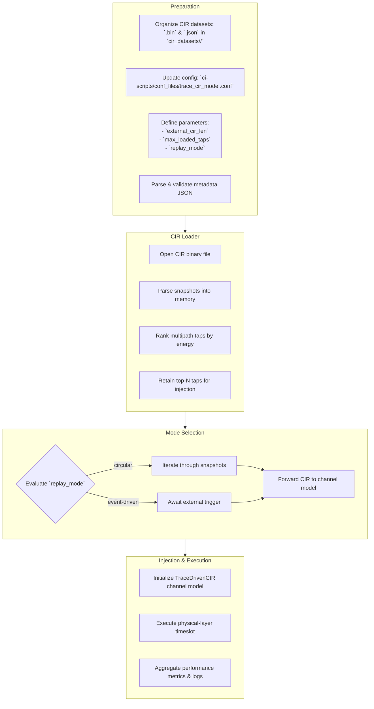

# RT-Driven Channel Injection in OAI rfsimulator

## Overview

This contribution introduces a modular mechanism for injecting site-specific, time-synchronized Channel Impulse Responses (CIRs)—generated by ray-tracing tools (e.g., NVIDIA SionnaRT)—directly into the OAI rfsimulator. This enables true digital twin evaluation, and repeatable benchmarking under physically realistic, deterministic wireless channels.

## Implementation Details



- **New channel model `TraceDrivenCIR_SionnaRT` in `random_channel.c`:**

  - Loads deterministic CIR datasets from binary files using a user-extensible config.
  - Replaces OAI’s internal stochastic channel with scenario-accurate, per-timeslot CIR replay.

- **Flexible loader (`taps_loader.c/h`):**

  - Reads float32 binary CIRs, selects top-N multipath taps by energy, preserves tap order for causality.
  - Highly efficient for large traces.

- **Config-driven operation:**

  - All dataset and parameter selection handled via a `.conf` file—no code changes needed for new environments.
  - Includes robust error handling and full logging for debugging and reproducibility.

- **Minimal OAI intrusion:**
  - No changes to OAI core logic; the channel model acts as a plug-in via documented extension points.

## Dataset Format

### Binary File

Each snapshot is stored in the following format:

`[ Re_0 | Re_1 | ... | Re_L-1 | Im_0 | Im_1 | ... | Im_L-1 ] (float32)`

Where **L** is the number of taps per snapshot. Snapshots are stored sequentially, no delimiters.

### Metadata File (JSON, recommended)

Not parsed by OAI, but should accompany every dataset for traceability and reproducibility:

```json
{
  "scene": "urban_macro v4.2",
  "frequency_Hz": 3.5e9,
  "bandwidth_Hz": 1e8,
  "taps": 107,
  "snapshots": 9000,
  "subcarriers": 4096,
  "spacing_Hz": 30000,
  "normalize": true,
  "description": "SionnaRT trace for DT validation"
}
```

## How To Adapt for Your Use Case

1. Generate or acquire a CIR dataset in the format above.

2. Place your `.bin` and optional `.json` files in a folder, e.g.:

`cir_datasets/urban_macro/`

3. Create or edit the channel config file:
   `ci-scripts/conf_files/trace_cir_model.conf`

Example:

```ini
[external_cir_model]
cir_file = "../../cir_datasets/urban_macro/SionnaRT_CIR.bin"
external_cir_len = 107            # taps per snapshot in your .bin file
max_loaded_taps = 15              # top-N by energy to inject (<= external_cir_len)
replay_mode = circular            # (future: freeze, repeat, event-driven, etc.)
metadata_file = "./cir_datasets/urban_macro/scenario_metadata.json"
```

4. Rebuild OAI if you modified any source files.

5. Launch the gNB and UE with `chanmod` enabled.

### Launch with Deterministic Channel Model

#### gNB

```bash
sudo ./nr-softmodem -O ../../../targets/PROJECTS/GENERIC-NR-5GC/CONF/gnb.sa.band78.fr1.106PRB.usrpb210.dt.conf \
    --gNBs.[0].min_rxtxtime 6 \
    --rfsim \
    --rfsimulator.options chanmod \
    --telnetsrv
```

#### UE

```bash
sudo ./nr-uesoftmodem -r 106 --numerology 1 --band 78 -C 3619200000 \
    --rfsim --rfsimulator.serveraddr 127.0.0.1 \
    --uicc0.imsi 001010000000001\
    -O ../../../ci-scripts/conf_files/nrue.uicc.dt.conf \
    --rfsimulator.options chanmod
```

## Future Extensions & Roadmap

- **Event‑Driven Trigger**  
  Support replay modes like `event-triggered` or `freeze-last`, driven by external events (e.g., control‑plane messages or GPIO signals) to advance or pause the CIR snapshot index.

- **MIMO Support**  
  Extend the loader to read per‑antenna CIR matrices from binary (or separate files) and inject fully‑spatial channel matrices into OAI’s multi‑TX/RX chains for true MIMO replay.

