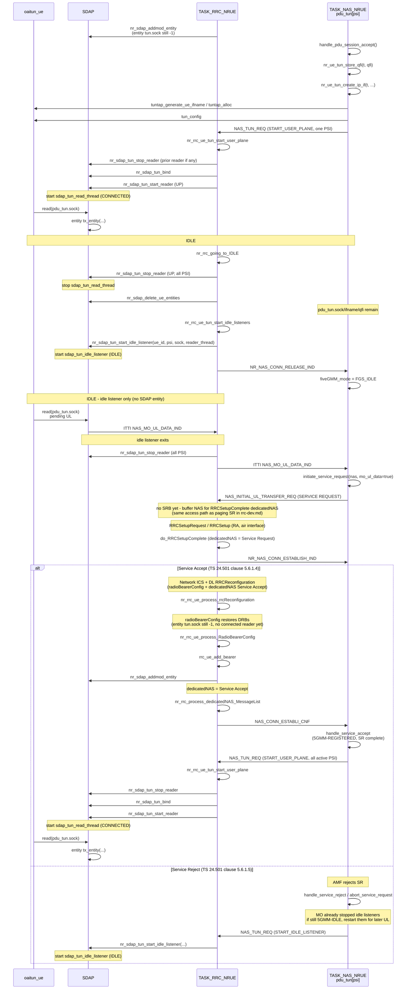

<!-- SPDX-License-Identifier: CC-BY-4.0 -->

# 5GS NAS Overview and OAI Implementation status

This document provides an overview of the 5G System Non-Access Stratum (5GS NAS) protocol as specified in 3GPP TS 24.501. It highlights key message types involved in Mobility and Session Management and explains how these are implemented within the OAI software stack. The document outlines the structure of the OAI codebase by detailing current support for encoding, decoding, and unit testing of specific NAS messages, and explains how the UE handles USIM simulation and message generation.

[[_TOC_]]

## About 5GS NAS

The 5G System Non-Access Stratum (5GS NAS) is defined in 3GPP TS 24.501. It operates within the control plane, facilitating communication between the User Equipment (UE) and the Access and Mobility Management Function (AMF) over the N1 interface.

Key 5GS NAS messages:

* Mobility Management (5GMM): Handles UE registration, deregistration, authentication and tracking area updates. 5GMM also manages transitions between idle and connected states.
* Session Management (5GSM): Establishes, modifies, and releases PDU sessions. Coordinates with the Session Management Function (SMF) to manage user-plane resources.

## OAI Implementation Status

The following table lists NAS messages with dedicated `encode_*` / `decode_*` codecs under
`openair3/NAS/NR_UE/5GS/` (`5GMM/MSG`, `5GSM/MSG`). Unit test entries refer to
[`nas_lib_test.c`](../openair3/NAS/NR_UE/5GS/tests/nas_lib_test.c), most are encode/decode round-trips.

| Type  | Message                                   | Encoding | Decoding | Unit test |
|-------|-------------------------------------------|----------|----------|------------|
| 5GMM  | Service Request                           | yes      | yes      | yes        |
| 5GMM  | Service Accept                            | yes      | yes      | yes        |
| 5GMM  | Service Reject                            | yes      | yes      | yes        |
| 5GMM  | Authentication Failure                    | yes      | yes      | yes        |
| 5GMM  | Authentication Reject                     | yes      | yes      | yes        |
| 5GMM  | Security Mode Reject                      | yes      | yes      | yes        |
| 5GMM  | Identity Request                          | no       | yes      | no         |
| 5GMM  | Authentication Response                   | yes      | no       | no         |
| 5GMM  | Identity Response                         | yes      | no       | no         |
| 5GMM  | Security Mode Complete                    | yes      | no       | no         |
| 5GMM  | Uplink NAS Transport                      | yes      | no       | no         |
| 5GMM  | Registration Request                      | yes      | yes      | no         |
| 5GMM  | Registration Accept                       | yes      | yes      | yes        |
| 5GMM  | Registration Complete                     | yes      | yes      | no         |
| 5GMM  | Deregistration Request (UE originating)   | yes      | no       | no         |
| 5GSM  | PDU Session Establishment Request         | yes      | no       | no         |
| 5GSM  | PDU Session Establishment Accept          | no       | yes      | no         |

### Runtime-handled messages

These network-originated messages are handled in [`nr_nas_msg.c`](../openair3/NAS/NR_UE/nr_nas_msg.c):

* Authentication Request
* Security Mode Command
* Downlink NAS Transport
* Deregistration Accept (UE originating)
* Registration Reject
* PDU Session Establishment Reject
* Service Accept
* Service Reject

## Integration testing

End-to-end attach can be tested with the [NR UE NAS simulator](../tests/nr-ue-nas-simulator/README.md),
which runs the OAI UE NAS stack and gNB NGAP against the AMF, forwarding NAS PDUs without PHY/MAC/RLC.
Use `nas_lib_test` for isolated codec round-trips.

### Code Structure

[openair3/NAS/NR_UE/nr_nas_msg.c](../openair3/NAS/NR_UE/nr_nas_msg.c):
* NAS procedures and message handlers/callbacks
* Integration with RRC (ITTI)
* UE TUN state via [`nr_ue_tun`](../openair3/NAS/NR_UE/nr_ue_tun.h) (`pdu_tun[]`)
* Invokes enc/dec libraries
* Handles 5GMM state and mode
* Does not call SDAP TUN APIs directly (RRC starts/stops TUN readers)

[openair3/NAS/NR_UE/5GS/fgs_nas_lib.c](../openair3/NAS/NR_UE/5GS/fgs_nas_lib.c):

* top-level encode/decode dispatch for NAS 5GMM/5GSM payloads
* delegates message-specific encoding/decoding to `5GMM/MSG` and `5GSM/MSG`

[openair3/NAS/NR_UE/5GS/NR_NAS_defs.h](../openair3/NAS/NR_UE/5GS/NR_NAS_defs.h):

* 5GS NAS message types and security header definitions
* shared NAS structures used by UE NAS handlers and encoders
* prototypes for 5GMM header and security-header encode/decode, implementations in `fgs_nas_lib.c`

[openair3/NAS/NR_UE/5GS/fgs_nas_utils.h](../openair3/NAS/NR_UE/5GS/fgs_nas_utils.h):

* NAS helpers, macros

[openair3/NAS/NR_UE/5GS/5GMM](../openair3/NAS/NR_UE/5GS/5GMM):

* encoding/decoding functions and definitions for 5GMM NAS messages payloads

[openair3/NAS/NR_UE/5GS/5GMM/MSG/fgmm_lib.c](../openair3/NAS/NR_UE/5GS/5GMM/MSG/fgmm_lib.c):

[openair3/NAS/NR_UE/5GS/5GMM/MSG/fgmm_lib.h](../openair3/NAS/NR_UE/5GS/5GMM/MSG/fgmm_lib.h):

* encoding/decoding functions and definitions for common 5GMM IEs

[openair3/NAS/NR_UE/5GS/5GSM](../openair3/NAS/NR_UE/5GS/5GSM):

* encoding and decoding functions for 5GSM NAS messages payloads

## USIM Simulation

OAI includes a simulated USIM implementation that reads its parameters from standard configuration files. This allows for rapid prototyping and testing without relying on a physical UICC card. The USIM-related configuration is handled via the `init_uicc()` function.

### Configuration

The simulation reads values from a named section in the config file.

**Config options in the `uicc` section**:

| Parameter                    | Description                       | Default value                                                      |
|------------------------------|-----------------------------------|--------------------------------------------------------------------|
| `imsi`                       | User IMSI                         | `2089900007487`                                                    |
| `nmc_size`                   | Number of digits in NMC           | `2`                                                                |
| `key`                        | Subscription key (Ki)             | `fec86ba6eb707ed08905757b1bb44b8f`                                 |
| `opc`                        | OPc value                         | `c42449363bbad02b66d16bc975d77cc1`                                 |
| `amf`                        | AMF value                         | `8000`                                                             |
| `sqn`                        | Sequence number                   | `000000`                                                           |
| `dnn`                        | Default DNN (APN)                 | `oai`                                                              |
| `nssai_sst`                  | NSSAI slice/service type          | `1`                                                                |
| `nssai_sd`                   | NSSAI slice differentiator        | `0xffffff`                                                         |
| `imeisv`                     | IMEISV string                     | `6754567890123413`                                                 |
| `routing_indicator`          | Routing Indicator                 | `0000`                                                             |
| `protection_scheme`          | SUCI Profile Scheme               | `0`                                                                |
| `home_network_public_key_id` | Home Network Public Key ID        | `1`                                                                |
| `home_network_public_key`    | Home Network Public Key           | `5a8d38864820197c3394b92613b20b91633cbd897119273bf8e4a6f4eec0a650` |

These are parsed and stored in the `uicc_t` structure.

### Initialization

The UE calls `init_uicc` via `checkUicc` to allocate memory for the `uicc_t` structure member and load parameters using `config_get()` from the selected config section. Then the UICC structure is stored in the NAS context. `nr_ue_nas_t`, to be used to fill identity and security credentials when generating responses to 5GC messages such as `Identity Response`, `Authentication Response`, and `Security Mode Complete`.

### Milenage Authentication and Key Derivation

When the UE receives a **5GMM Authentication Request**, the function `generateAuthenticationResp` generates a valid `Authentication Response` with the necessary derived NAS and AS security keys. The function `derive_ue_keys` parses the Authentication Request and performs the entire 5G AKA key hierarchy:

* Extracts the `RAND` and `SQN`
* Performs Milenage Algorithms f2-f5 using `f2345()` from the UICC input
* Computes the `RES` using `transferRES()`
* Derives the keys `KAUSF`, `KSEAF`, `KAMF`, `KNASenc`/`KNASint` via `derive_knas()` and `KGNB` for RRC ciphering (via `derive_kgnb()`)

### Security Mode Complete

When the UE receives a **Security Mode Command** from the 5GC, it responds with a `Security Mode Complete` message. This message is protected with the newly established NAS security context and may carry additional payloads, including the UE’s identity and a nested NAS message (e.g., `Registration Request`) in the `FGSNasMessageContainer`. The function responsible for building and securing this response is `generateSecurityModeComplete`.

#### IMEISV

The **IMEISV**, is encoded using the `fill_imeisv()` helper. This function extracts each digit from the configured `imeisvStr` in the UICC context and populates the mobile identity structure.

See TS 24.501 §4.4 for reference.

#### SUCI (Subscription Concealed Identifier)

The **SUCI**, is generated using the `fill_suci()` helper. This function extracts the MCC, MNC, and MSIN from the configured `imsi` with the use of `nmc_size` in the UICC context and populates the mobile identity structure.

Contains:
* MCC and MNC (public network identity)
* Routing Indicator
* Protection Scheme ID
* Home Network Public Key ID
* Concealed or clear MSIN depending on the protection scheme

If the UE is unable to generate SUCI due to configuration or crypto limitations, the UE will fail to generate a `Registration Request`.

###### 0. Null Scheme (TS 33.501 §C.2)

MSIN in cleartext.

###### 1. Profile A (TS 33.501 §C.3.4.1)

MSIN is concealed using elliptic curve cryptography.
Based on:
* Curve25519 for key agreement
* X9.63 KDF for key derivation

(requires OpenSSL ≥ 3.0)

###### 2. Profile B (TS 33.501 §C.3.4.2)

MSIN is concealed using elliptic curve cryptography.
Based on:
* P-256 for key agreement
* X9.63 KDF for key derivation

(currently not supported)

## UE-initiated Service Request (MO UL in 5GMM-IDLE)

TS 23.502 clause 4.2.3.2 and TS 24.501 clause 5.6.1 (case d: UL user data pending). Contrast with network-triggered (paging) SR in [`doc/RRC/rrc-dev.md`](RRC/rrc-dev.md).

NAS owns `pdu_tun[]` (sock / ifname / qfi / `reader_thread`) for the life of the PDU session. Connected and idle TUN readers are started and stopped by RRC via `nr_sdap_tun_*`, NAS only asks RRC through `NAS_TUN_REQ`.

