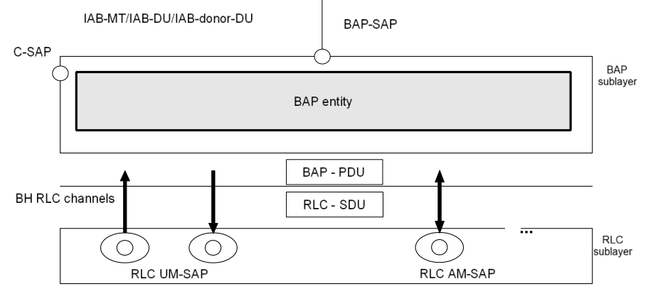
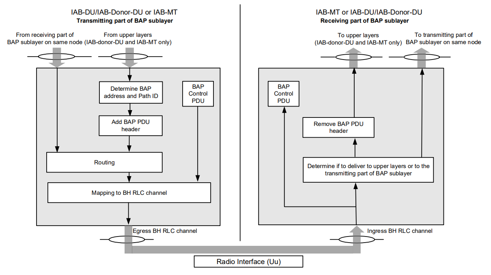

<table style="border-collapse: collapse; border: none;">
  <tr style="border-collapse: collapse; border: none;">
    <td style="border-collapse: collapse; border: none;">
      <a href="http://www.openairinterface.org/">
         
         </img>
      </a>
    </td>
    <td style="border-collapse: collapse; border: none; vertical-align: center;">
      <b>BAP Documentation</b>
    </td>
  </tr>
</table>

**Table of Contents**

[[_TOC_]]

# Glossary

| Acronym | Description                    |
| ------- | ------------------------------ |
| BAP     | Backhaul Adaptation Protocol   |
| BH      | Backhaul                       |
| CU      | Centralized Unit               |
| DU      | Distributed Unit               |
| IAB     | Integrated Access and Backhaul |
| IE      | Information Element            |
| MT      | Mobile Termination             |
| RLC     | Radio Link Control             |
| RRC     | Radio Resource Control         |

# 1. Scenario

This document aims to gather all the needed requirements to implement the Backhaul Adaptation Protocol (BAP) (Based on TS 38.340-i00 (release 18)).

# 2. General

## 2.1. Entities

BAP is a layer 2 routing protocol that sits on top of the RLC layer and is responsible for routing packages through multiple node hops.

   
  <em>Figure 2.1-1 - BAP layer structure view (TS 38.340)</em>

BAP works with entities:

-   BAP entity at node MT;
-   BAP entity at node DU;
-   BAP entity at donor DU.

The transmitting part of BAP entity has a corresponding receiving part of another BAP entity.

   
  <em>Figure 2.1-2 - Example of BAP Layer Functionality (TS 38.340)</em>

## 2.2. Services

### 2.2.1 BAP -> upper layers

(Service that needs to be performed by BAP)

-   Data transfer.

### 2.2.2 Lower layer (Per RLC entity) -> BAP

(Services expected from lower levels to BAP)

-   Acknowledged data transfer service;
-   Unacknowledged data transfer service.

## 2.3. Functions

A BAP sublayer must support the following functions:

-   Data transfer;
-   Determination of BAP destination and path for packets from upper layers;
-   Determination of egress BH RLC channels for packets routed to next hop;
-   Routing of packets to next hop;
-   BAP header rewriting;
-   Differentiating traffic to be delivered to upper layers from traffic to be delivered to egress link;
-   Flow control feedback and polling signalling;
-   Handling of BH RLF related indications.

## 2.4. Configurations

The configuration of the BAP entity includes:

-   The IAB-node's BAP address(es) via RRC;
-   The IAB-donor-DU's BAP address via F1AP;
-   Mapping from next hop BAP address to downstream egress link via F1AP;
-   Mapping from next hop BAP address to upstream egress link via RRC;
-   Mapping from upper layer traffic to BAP routing ID in BAP header via F1AP and RRC;
-   The BAP routing entries via F1AP;
-   Mapping to egress BH RLC channels via F1AP and RRC;
-   Flow control feedback type(s) to be provided, if any, via RRC;
-   Inter-donor-DU re-routing enabling/disabling via F1AP.

Configure **RLC** channels:

-   Via RRC on the IAB-MT;
-   via F1AP on the IAB-DU/IAB-donor-DU.

The **F1AP** configurations (Which derive from the original F1AP signaling) are:

-   Uplink Traffic to Routing ID Mapping Configuration;
-   Downlink Traffic to Routing ID Mapping Configuration;
-   BH Routing Configuration;
-   BH RLC Channel Mapping Configuration;
-   Uplink Traffic to BH RLC Channel Mapping Configuration;
-   Downlink Traffic to BH RLC Channel Mapping Configuration;
-   Header Rewriting Configuration.

# 3. Procedures

## 3.1. BAP entity handling

### 3.1.1 Entity establishment

When upper layers request establishment of a BAP entity, the node shall:

-   Establish a BAP entity;
-   Follow the other procedures in this section.

### 3.1.2 Entity release

When upper layers request release of a BAP entity, the node shall:

-   Release the BAP entity and the related BAP configurations.

## 3.2 Data transfer

### 3.2.1 Transmitting Operations

#### **3.2.1.1 General**

Upon **receiving a BAP SDU** from upper layers, the **transmitting part** of the BAP entity shall:

-   **(Clause ####)** Select a BAP address and a BAP path identity for this BAP SDU;
-   **(Clause ####)** Construct a BAP Data PDU by adding a BAP header to the BAP SDU, where:
    -   **DESTINATION** field is set to the selected BAP address;
    -   **PATH** field is set to the selected BAP path identity.

When the BAP entity has a **BAP Data PDU to transmit**, the **transmitting part** of the BAP entity shall:

-   **(Clause ####)** For the boundary IAB-node, if the BAP Data PDU is received from the collocated BAP entity (in the same node), perform the BAP header rewriting operation (if configured);
-   **(Clause ####)** Perform routing to determine the egress link;
-   **(Clause ####)** Determine the egress BH RLC channel;
-   Submit this BAP Data PDU to the selected egress BH RLC channel of the selected egress link.

#### **3.2.1.2 BAP routing ID selection**

**At IAB-node**

At an IAB-node, for a BAP SDU received from upper layers and to be transmitted in upstream direction, the BAP entity performs mapping to a BAP address and BAP path identity based on:

-   Uplink Traffic to Routing ID Mapping Configuration, which is derived from F1AP on the IAB-node in TS 38.473;

-   _defaultUL-BAP-RoutingID_, which is configured by RRC on the IAB-node in TS 38.331.

Each entry of the Uplink Traffic to Routing ID Mapping Configuration contains:

-   A traffic type specifier, which is indicated by _UL UP TNL Information_ IE for F1-U packets and _Non-UP TrafficType_ IE for non-F1-U packets in TS 38.473;

-   A BAP routing ID, which includes a BAP address and a BAP path identity, indicated by _BAP Routing ID_ IE in _BH Information_ IE in TS 38.473;

For a BAP SDU received from upper layers and to be transmitted in upstream direction, the BAP entity shall:

<pre>
<b>if</b> the Uplink Traffic to Routing ID Mapping Configuration has not 
been (re)configured by the F1AP associated with the (logical) DU, where
this BAP SDU is received, after the last (re)configuration of 
<i>defaultUL-BAPRoutingID</i> by RRC:
    <b>select</b> the BAP address and the BAP path identity as configured by
    <i>defaultUL-BAP-RoutingID</i> in TS 38.331 for non-F1-U packets;
<b>else</b>:
    <b>for the</b> BAP SDU encapsulating an F1-U packet:
        <b>select</b> an entry from the Uplink Traffic to Routing ID Mapping
        Configuration with its traffic type specifier corresponds to the 
        destination IP address and TEID of this BAP SDU;
    <b>for the</b> BAP SDU encapsulating a non-F1-U packet:
        <b>select</b> an entry from the Uplink Traffic to Routing ID Mapping
        Configuration with its traffic type specifier corresponds to the 
        traffic type of this BAP SDU;
<b>select</b> the BAP address and the BAP path identity from the BAP routing ID in the entry 
selected above;
<b>if</b> the selected entry is configured with <i>Non-F1-terminating IAB-donor Topology
Indicator</i> IE:
    <b>consider</b> this BAP Data PDU as data to be routed to non-F1-terminating
    donor topology
</pre>

**At IAB-donor-DU**

For a BAP SDU received from upper layer at the IAB-donor-DU, the BAP entity performs mapping to a BAP address and a BAP Path identity based on:

-   Downlink Traffic to Routing ID Mapping Configuration, which is derived from <i>IP-to-layer-2 traffic mapping Information List</i> IE configured on the IAB-donor-DU in TS 38.473.

Each entry of the Downlink Traffic to Routing ID Mapping Configuration contains:

-   A destination IP address, which is indicated by <i>Destination IAB TNL Address</i> IE in IP header information IE, including an IPv4 address or IPv6 address or an IPv6 address prefix;

-   An IPv6 flow label, if configured, which is indicated by <i>IPv6 Flow Label</i> IE in <i>IP header information</i> IE;

-   A DSCP, if configured, which is indicated by <i>DSCP</i> IE in <i>DS Information List</i> IE in <i>IP header information</i> IE;

-   A BAP routing ID, which is indicated by <i>BAP Routing ID</i> IE in <i>BH Information</i> IE in TS 38.473.

For a BAP SDU received from upper layers and to be transmitted in downstream direction, the BAP entity shall:

<pre>
<b>for the</b> BAP SDU encapsulating an IPv6 packet:
    # (not very relevant) Check TS 38.340
<b>for the</b> BAP SDU encapsulating an IPv4 packet:
    <b>Select</b> an entry from the Downlink Traffic to Routing ID Mapping
    Configuration which fulfils the following conditions:
        This BAP SDU Destination IP address == Destination IP address in 
        this entry
        AND
        This BAP SDU DSCP == DSCP in this entry (if configured)
<b>select</b> the BAP address and the BAP path identity from the BAP routing ID in
the entry selected above
</pre>

#### **3.2.1.3 Routing**

BAP entity performs routing based on the BH Routing Configuration derived from an F1AP message, as specified in TS 38.473.
Each entry of the BH Routing Configuration contains:

-   <b>BAP Routing ID</b> consisting of a BAP address and a BAP path identity, which is indicated by _BAP Routing ID_ IE;

-   <b>Next Hop BAP Address</b> which is indicated by _Next-Hop BAP Address_ IE;

-   <b>Topology indicator</b>, indicating whether the entry belongs to the non-F1-terminating donor topology, which is optionally indicated by _Non-F1-terminating IAB-donor Topology Indicator_ IE.

For a BAP Data PDU to be transmitted, BAP entity shall:

<pre>
<b>if</b> the BAP Data PDU corresponds to a BAP SDU received from the upper layer
AND
<b>if</b> the BH Routing Configuration has not been (re)configured by the F1AP
associated with the (logical) DU, where this BAP SDU is received, after the 
last (re)configuration of <i>defaultUL-BH-RLC-Channel</i> by RRC:
    <b>select</b> the egress link on which the egress BH RLC channel corresponding
    to <i>defaultUL-BH-RLC-Channel</i> is configured as specified in TS 38.331 for
    non-F1-U packets;
<b>else if</b> there is an entry in the BH Routing Configuration whose BAP
address matches the DESTINATION field, whose BAP path identity is the 
same as the PATH field, and whose egress link corresponding to the Next Hop
BAP Address is available:
    <b>select</b> the egress link corresponding to the Next Hop BAP Address 
    of the entry;
<b>else if</b> there is at least one entry in the BH Routing Configuration whose 
BAP address matches the DESTINATION field, and whose egress link corresponding 
to the Next Hop BAP Address is available:
    <b>select</b> an entry from the BH Routing Configuration whose BAP address
    is the same as the DESTINATION field, and whose egress link corresponding
    to the Next Hop BAP Address is available;
    <b>select</b> the egress link corresponding to the Next Hop BAP Address of
    the entry selected above;
<b>else if</b>, for the transmitting part of IAB-MT, at least one egress link is
available, and if <i>Re-routing Enable Indicator</i> IE is set to true by F1AP:
    <b>if</b> this egress link belongs to F1-terminating donor topology of the
    boundary IAB-node or the transmitting part of IAB-MT is not at the 
    boundary IAB-node, and there is an entry in the BH Routing Configuration 
    not configured with <i>Non-F1-terminating IAB-donor Topology Indicator</i> IE 
    whose Next Hop BAP Address corresponds to this egress link
    OR
    <b>if</b> this egress link belongs to non-F1-terminating donor topology, and
    there is an entry in the BH Routing Configuration configured with
    <i>Non-F1-terminating IAB-donor Topology Indicator</i> IE whose Next Hop BAP
    Address corresponds to this egress link:
        <b>select</b> the egress link;
        <b>rewrite</b> the BAP header of this BAP Data PDU, where the DESTINATION
        field is set to the leftmost 10 bits of BAP Routing ID of the entry in
        the BH Routing Configuration (i.e. BAP address), and the PATH field is 
        set to the rightmost 10 bits of BAP Routing ID of the entry (i.e. BAP
        path identity)
</pre>

#### **3.2.1.4 Mapping to BH RLC Channel**

**Mapping to BH RLC Channel for BAP Data Packets from collocated BAP entity at IAB-node**

Check page 14 and 15

**Mapping to BH RLC Channel for BAP SDUs from upper layers at IAB-node**

Check page 15 and 16

**Mapping to BH RLC Channel at IAB-donor-DU**

Check page 16 and 17

#### **3.2.1.4 BAP header rewriting operation**

Check page 17

### 3.2.2 Receiving Operations

Upon receiving a BAP Data PDU from lower layer (i.e. ingress BH RLC channel), the receiving part of the BAP entity shall:

<pre>
<b>if</b> DESTINATION field of this BAP Data PDU matches the BAP address, which 
is configured for this IAB-node by the IAB-donor providing this ingress BH RLC
channel configuration:
  <b>remove</b> the BAP header of this BAP Data PDU and deliver the BAP SDU to 
  upper layers;
<b>else</b>:
  <b>deliver</b> the BAP Data Packet to the transmitting part of the collocated 
  BAP entity.
</pre>

## 3.3 Flow control

Check page 18

## 3.4 BH RLF related indications

Check page 19

## 3.5 Handling of unknown, unforeseen, and erroneous protocol data

When a BAP Data PDU contains a BAP address which is not included in the applied entries of BH Routing
Configuration during Routing operation in accordance with clause 5.2.1.3 and the BAP Data PDU contains a BAP
address which is not the BAP address of this node in accordance with clause 5.2.2 upon receiving; or
when a BAP Control PDU that contains reserved or invalid values is received the BAP entity shall:

-   discard the received BAP PDU.

# 4 Protocol data units, formats, and parameters

## 4.1 Protocol data units

### 4.1.1 Data PDU

Used to convey:

-   Upper layer data.

### 4.1.2 Control PDU

Used to convey:

-   Flow control feedbacck per BH RLC channel;
-   Flow control feedback per BAP routing ID;
-   flow control polling;
-   BH RLF related indication.

## 4.2 Formats and Parameters

Check pages 20 to 23
