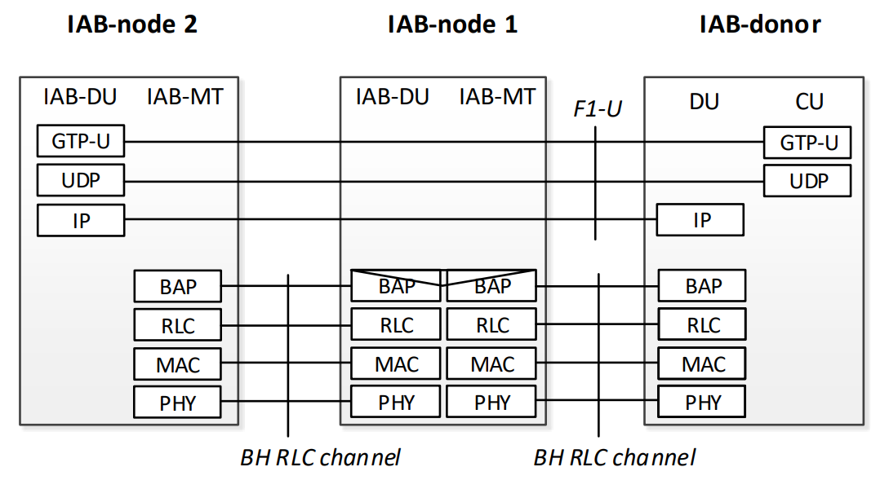
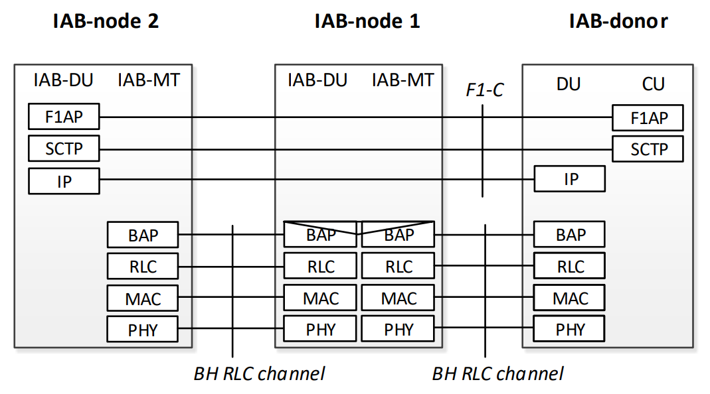
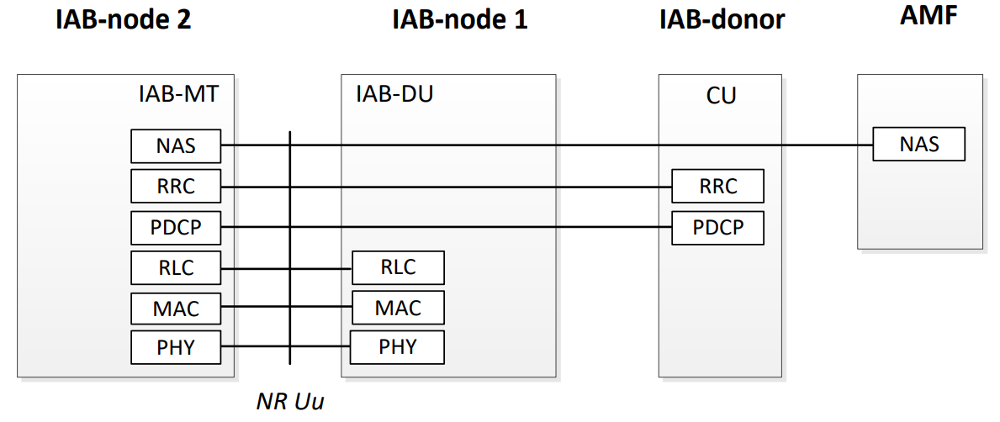
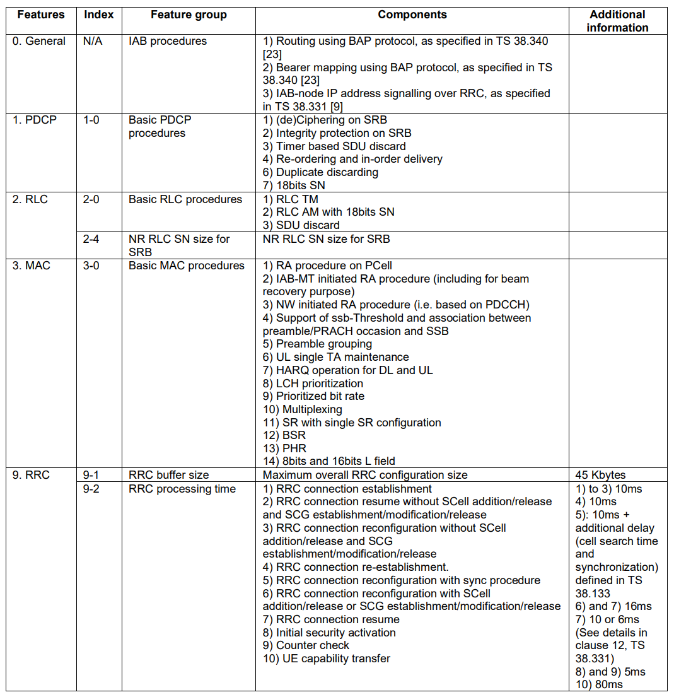
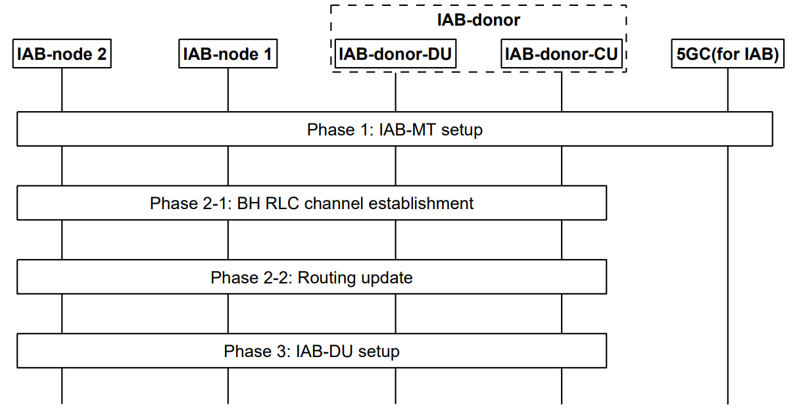
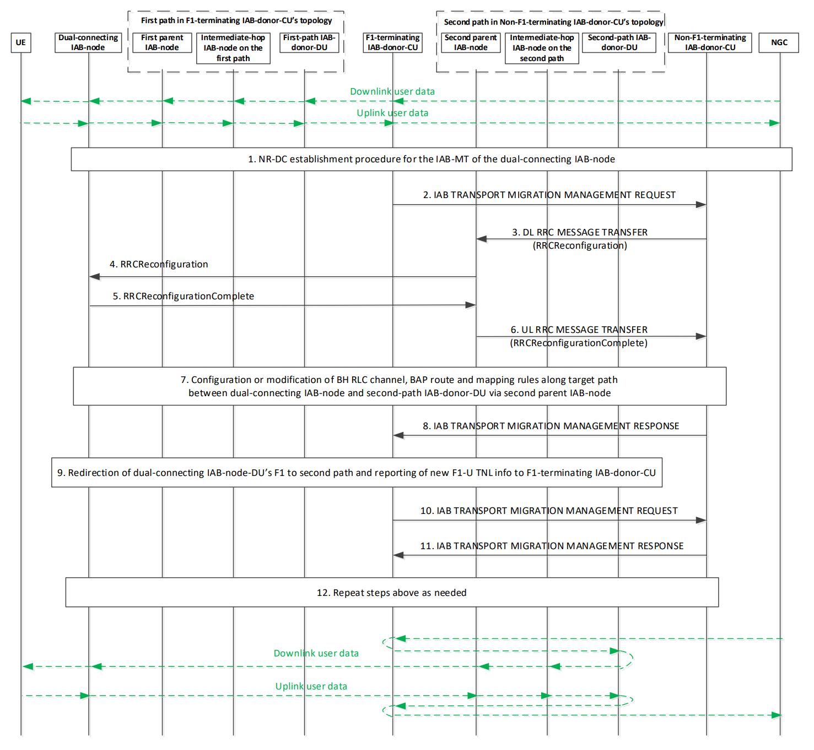
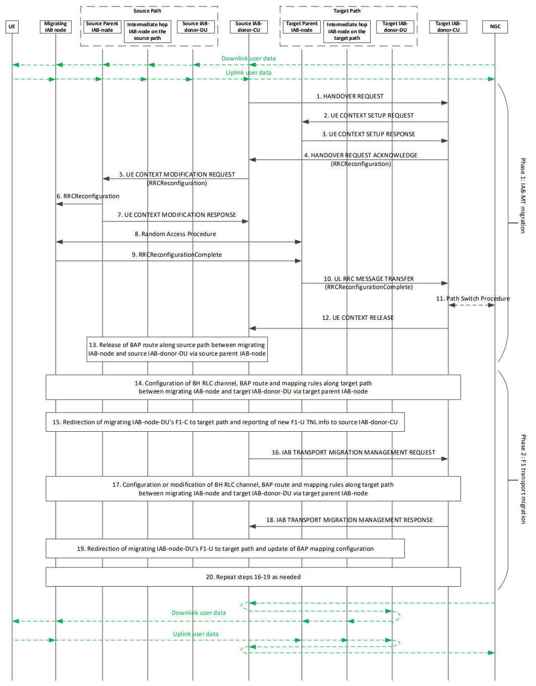
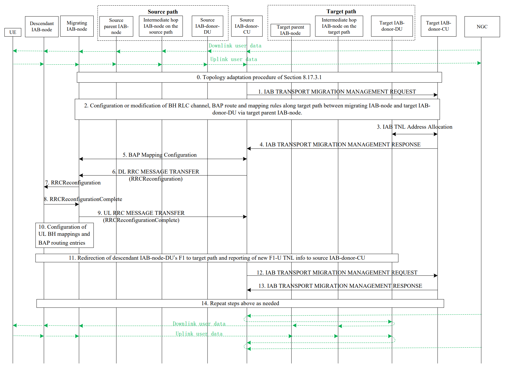
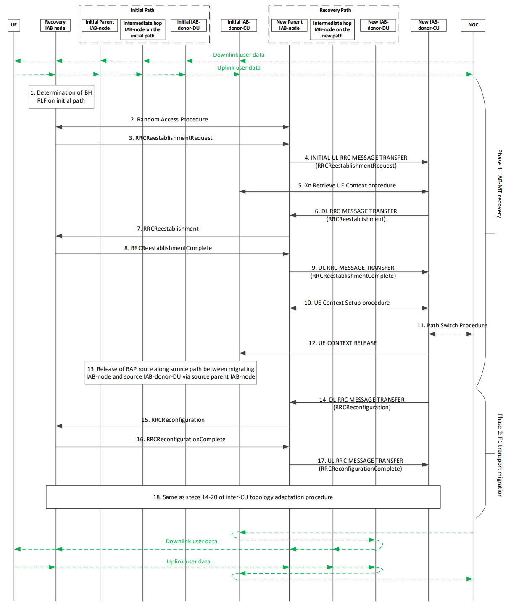

<table style="border-collapse: collapse; border: none;">
  <tr style="border-collapse: collapse; border: none;">
    <td style="border-collapse: collapse; border: none;">
      <a href="http://www.openairinterface.org/">
         
         </img>
      </a>
    </td>
    <td style="border-collapse: collapse; border: none; vertical-align: center;">
      <b>OAI IAB Documentation</b>
    </td>
  </tr>
</table>

**Table of Contents**

[[_TOC_]]

# Glossary

| Acronym | Description                    |
| ------- | ------------------------------ |
| BAP     | Backhaul Adaptation Protocol   |
| BH      | Backhaul                       |
| CP      | Control Plane                  |
| IAB     | Integrated Access and Backhaul |
| RLC     | Radio Link Control             |
| RLF     | Radio Link Failure             |
| RRC     | Radio Resource Control         |
| TNL     | Transport Network Layer        |
| UP      | User Plane                     |

# 1. Scenario

This document aims to gather all the needed requirements to implement a 5G SA 3GPP compliant Integrated Access and Backhaul (IAB).

# 2. Protocol Stacks

## 2.1 Protocol stack for the support of F1-U protocol

## 2.2 Protocol stack for the support of F1-C protocol

## 2.3 Protocol stack for the support of IAB-MT's RRC and NAS connections

# 3. Backhaul Adaptation Protocol (BAP) (TS 38.340)

Some info in [BAP_info](./BAP_Info.md)

# 4. F1 Mods (TS 38.470 and 38.473)

Needed functions:

-   BAP mapping configuration function;
-   gNB-DU resource configuration function;
-   IAB TNL address configuration function;
-   IAB UP configuration update function;
-   Mobile IAB F1 Setup Triggering function; (Can we skip mobile IAB for now?)
-   Mobile IAB F1 Setup Outcome Notification function. (Can we skip mobile IAB for now?)

# 5. RRC Mods (TS 38.331)

Some info in [RRC_IAB_info](./RRC_IAB_Info.md)

# 6. IAB-MT mandatory features (TS 38.306)

-   Routing using BAP (TS 38.340-i00 (release 18), pages 11-17)
-   Bearer mapping using BAP (TS 38.340-i00 (release 18), pages 11-17)
-   IAB-node IP address signalling over RRC (TS 38.331-i00 (release 18), page 133)

# 7. IAB Resource Configuration (TS 38.300)

Check TS 38.300-i00 (release 18), pages 122 and 123.

# 8. Required signalling procedures (TS 38.300 and TS 38.401)

## 8.1 IAB-node Integration (TS 38.401-i00, page 87 and 88)

## _8.2 IAB-node Migration (Mobile IAB???)_

## 8.3 Topological Management (TS 38.300-i00, page 34)

### 8.3.1 IAB Inter-donor-DU Re-routing (TS 38.401-i00, pages 105, 106)

When an IAB-donor-DU is configured to support inter-donor-DU re-routing, the IAB-donor-DU may identify a rerouted UL IP packet based on the source IP address field of the UL packet, and forwards UL IP packets, whose source IP addresses are anchored at a peer IAB-donor-DU, to this peer IAB-donor-DU via a tunnel. The IAB-donor-DU and the peer IAB-donor-DU may be controlled by the same IAB-donor-CU or by two different IAB-donor-CUs. The interdonor-DU tunnel may be a GTP-U tunnel. The configuration of the tunnel is up to implementation. At the IAB-donor-DU forwarding the UL IP packets, inter-donor-DU tunnelling may be restricted to only a subset of the IP addresses anchored at the peer IAB-donor-DU. For this purpose, the IAB-donor-CU configures the IAB-donor-DU for forwarding the UL IP packets with a list of TNL addresses and/or prefixes for which tunnelling should be permitted and TNL
address filtering should be exempted.

### 8.3.2 IAB Inter-CU topological redundancy procedure (TS 38.3401-i00, pages 106, 107 and 108)

### 8.3.3 IAB Inter-CU topology adaptation procedure (TS 38.3401-i00, pages 108 to 111)

### 8.3.4 IAB inter-CU topology adaptation procedure with descendant IAB-node (TS 38.3401-i00, pages 111 to 113)

### 8.3.5 IAB Inter-CU Backhaul RLF recovery for single connected IAB-node (TS 38.3401-i00, pages 113 to 116)

## 8.4 OTA timing synchronization (38.300-i00, page 34)

An IAB-DU is subject to the same downlink timing alignment of a gNB. The IAB-DU may use the received downlink
signal from a parent as a reference to control its downlink timing using TA in conjunction with an additional Tdelta
parameter received by the collocated IAB-MT from the parent via MAC-CE.

## 8.5 Inter node discovery (38.300-i00, page 35)

Inter node discovery is supported via SSB-based and/or CSI-RS-based measurements. An IAB-node can be configured
to transmit and receive off synchronization raster SSB signals to discover neighbouring IAB-nodes. The configuration
is not expected to create a conflict between IAB-DU SSB transmission and IAB-MT SSB measurement windows.
