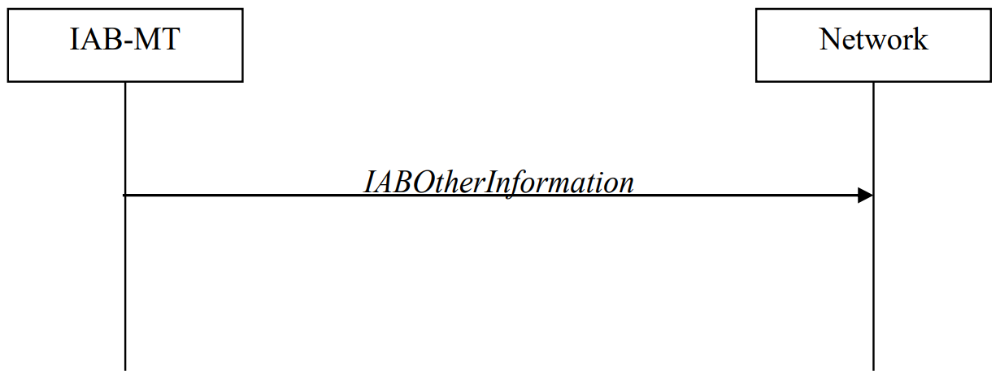

<table style="border-collapse: collapse; border: none;">
  <tr style="border-collapse: collapse; border: none;">
    <td style="border-collapse: collapse; border: none;">
      <a href="http://www.openairinterface.org/">
         
         </img>
      </a>
    </td>
    <td style="border-collapse: collapse; border: none; vertical-align: center;">
      <b>RRC - IAB related Documentation</b>
    </td>
  </tr>
</table>

**Table of Contents**

[[_TOC_]]

# Glossary

| Acronym | Description                    |
| ------- | ------------------------------ |
| BAP     | Backhaul Adaptation Protocol   |
| BH      | Backhaul                       |
| DL      | Downlink                       |
| IAB     | Integrated Access and Backhaul |
| IE      | Information Element            |
| MCG     | Master Cell Group              |
| RLC     | Radio Link Control             |
| RRC     | Radio Resource Control         |
| SCG     | Secondary Cell Group           |
| UL      | Uplink                         |

# 1. Scenario

This document aims to gather all the needed requirements to implement IAB in the Radio Resource Control (RRC) level (TS 38.331).

# 2. BAP configuration

The IAB-MT shall:

<pre>
<b>if</b> the <i>bap_Config</i> is set to <i>setup</i>:
    <b>if</b> no BAP entity is established:
        <b>establish</b> a BAP entity as specified in TS 38.340;
    <b>if</b> <i>bap-Address</i> is included:
        <b>configure</b> the BAP entity to use the bap-Address as this
        node's BAP address;
    <b>if</b> <i>defaultUL-BAP-RoutingID</i> is included:
        <b>configure</b> the BAP entity to apply the default UL BAP routing ID
        according to the configuration;
    <b>if</b> <i>defaultUL-BH-RLC-Channel</i> is included:
        <b>configure</b> the BAP entity to apply the default UL BH RLC channel
        according to the configuration;
    <b>if</b> <i>flowControlFeedbackType</i> is included:
        <b>configure</b> the BAP entity to apply the flow control feedback according
        to the configuration;
<b>if</b> the <i>bap-Config</i> is set to release:
    <b>release</b> the concerned <i>bap-Config</i>;
    <b>if</b> there is no other configured <i>bap-Config</i> for the MCG or for the SCG
        <b>release</b> the BAP entity as specified in TS 38.340.
</pre>

# 3. IAB other configuration

## 3.1 IP address release

The IAB-MT shall:

<pre>
<b>if</b> the release is triggered by reception of the <i>iab-IP-AddressToReleaseList</i>:
    <b>for each</b> <i>iab-IP-AddressIndex</i> value included in
    <i>iab-IP-AddressToReleaseList</i>:
        <b>release</b> the corresponding <i>IAB-IP-AddressConfiguration</i>.
</pre>

## 3.2 IP address addition/modification

The IAB-MT shall:

<pre>
<b>for each</b> <i>iab-IP-AddressIndex</i> value included in the <i>iab-IP-AddressToAddModList</i>
that is not part of the current IAB-MT configuration:
    <b>add</b> the IP address indicated in <i>iab-IP-Address</i>, corresponding to the
    <i>iab-IP-AddressIndex</i>.
    <b>if</b> added IP address is <i>iPv4-Address</i>:
        <b>if</b> <i>iab-IP-Usage</i> is set to <i>f1-C</i>:
            <b>store</b> the received IPv4 address for F1-C traffic together with
            the IAB-donor-DU BAP address corresponding to the 
            <i>iab-IP-AddressIndex</i>.
        <b>else if</b> <i>iab-IP-Usage</i> is set to <i>f1-U</i>:
            <b>store</b> the received IPv4 address for F1-U traffic together with
            the IAB-donor-DU BAP address corresponding to the 
            <i>iab-IP-AddressIndex</i>.
        <b>else if</b> <i>iab-IP-Usage</i> is set to <i>non-F1</i>:
            <b>store</b> the received IPv4 address for non-F1 traffic together with
            the IAB-donor-DU BAP address corresponding to the 
            <i>iab-IP-AddressIndex</i>.
        <b>else</b>:
            <b>store</b> the received IPv4 address for all traffic together with 
            the IAB-donor-DU BAP address corresponding to the 
            <i>iab-IP-AddressIndex</i>.
    <b>else if</b> <i>iPv6-Address</i> is included:
        <b>if</b> <i>iab-IP-Usage</i> is set to <i>f1-C</i>:
            <b>store</b> the received IPv6 address for F1-C traffic together with
            the IAB-donor-DU BAP address corresponding to the
            <i>iab-IP-AddressIndex</i>.
        <b>else if</b> <i>iab-IP-Usage</i> is set to <i>f1-U</i>:
            <b>store</b> the received IPv6 address for F1-U traffic together with
            the IAB-donor-DU BAP address corresponding to the 
            <i>iab-IP-AddressIndex</i>.
        <b>else if</b> <i>iab-IP-Usage</i> is set to <i>non-F1</i>:
            <b>store</b> the received IPv6 address for non-F1 traffic together with
            the IAB-donor-DU BAP address corresponding to the 
            <i>iab-IP-AddressIndex</i>.
        <b>else</b>:
            <b>store</b> the received IPv6 address for all traffic together with the
            IAB-donor-DU BAP address corresponding to the 
            <i>iab-IP-AddressIndex</i>.
    <b>else if</b> <i>iPv6-Prefix</i> is included in <i>iab-IP-AddressToAddModList</i>:
        <b>if</b> <i>iab-IP-Usage</i> is set to <i>f1-C</i>:
            <b>store</b> the received IPv6 address prefix for F1-C traffic together
            with the IAB-donor-DU BAP address corresponding to the
            <i>iab-IP-AddressIndex</i>.
        <b>else if</b> <i>iab-IP-Usage</i> is set to <i>f1-U</i>:
            <b>store</b> the received IPv6 address prefix for F1-U traffic together
            with the IAB-donor-DU BAP address corresponding to the
            <i>iab-IP-AddressIndex</i>.
        <b>else if</b> <i>iab-IP-Usage</i> is set to <i>non-F1</i>:
            <b>store</b> the received IPv6 address prefix for non-F1 traffic
            together with the IAB-donor-DU BAP address corresponding to the
            <i>iab-IP-AddressIndex</i>.
        <b>else</b>:
            <b>store</b> the received IPv6 address prefix for all traffic together
            with the IAB-donor-DU BAP address corresponding to the
            <i>iab-IP-AddressIndex</i>.
<b>for each</b> <i>iab-IP-AddressIndex</i> value included in the <i>iab-IP-AddressToAddModList</i>
that is part of the current IA-BMT configuration:
    <b>modify</b> the IP address configuration(s) in accordance with the
    <i>IAB-IP-AddressConfiguration</i> corresponding to the <i>iab-IP-AddressIndex</i>.
</pre>

# 4 "IAB Other Information" (Procedure)

   
  <em>Figure 4.1 - IAB Other information procedure (TS 38.331)</em>

The IAB Other Information procedure is used by IAB-MT to request the IAB-donor-CU to allocate IP address or
inform the IAB-donor-CU of the IP address for the collocated IAB-DU.

## 4.1 Initiation

Upon initiation of the procedure, the IAB-MT shall:

-   initiate transmission of the <i>IABOtherInformation</i> message.

## 4.2 Actions related to transmission of IABOtherInformation message

The IAB-MT shall set the contents of <i>IABOtherInformation</i> message as follows:

<pre>
<b>if</b> the procedure is used to request IP addresses:
    <b>if</b> IPv4 addresses are requested:
        <b>set</b> the <i>iab-IPv4-AddressNumReq</i> to the number of IPv4 addresses
        requested per specific usage;
    <b>if</b> IPv6 addresses or IPv6 address prefixes are requested:
        <b>if</b> IPv6 addresses are requested:
            <b>set</b> the <i>iab-IPv6-AddressNumReq</i> to the number of IPv6 addresses
            requested per specific usage;
        <b>else if</b> IPv6 address prefixes are requested:
            <b>set</b> the <i>iab-IPv6-AddressPrefixReq</i> to <i>true</i> per specific usage;
<b>if</b> the procedure is used to report IP addresses:
    <b>if</b> IPv4 addresses are reported:
        <b>include</b> <i>iPv4-Address</i> in <i>iab-IPv4-AddressReport</i>, and for each IP
        address included:
            <b>if</b> IPv4 addresses are used for F1-C traffic:
                <b>include</b> these addresses in <i>f1-C-Traffic-IP-Address</i>.
            <b>if</b> IPv4 addresses are used for F1-U traffic:
                <b>include</b> these addresses in <i>f1-U-Traffic-IP-Address</i>.
            <b>if</b> IPv4 address are used for non-F1 traffic:
                <b>include</b> these addresses in <i>non-f1-Traffic-IP-Address</i>.
            <b>if</b> IPv4 addresses are used for all traffic:
                <b>include</b> these addresses in <i>all-Traffic-IAB-IP-Address</i>.
    <b>if</b> IPv6 addresses or IPv6 address prefixes are reported:
        <b>if</b> IPv6 addresses are reported:
            <b>include</b> <i>iPv6-Address</i> in <i>iab-IPv6-AddressReport</i>.
            <b>for each</b> IP address included (in previous step):
                <b>if</b> IPv6 addresses are used for F1-C traffic:
                    <b>include</b> these addresses in <i>f1-C-Traffic-IP-Address</i>.
                <b>if</b> IPv6 addresses are used for F1-U traffic:
                    <b>include</b> these addresses in <i>f1-U-Traffic-IP-Address</i>.
                <b>if</b> IPv6 addresses are used for non-F1 traffic:
                    <b>include</b> these addresses in <i>non-f1-Traffic-IP-Address</i>.
                <b>if</b> IPv6 addresses are used for all traffic:
                    <b>include</b> these addresses in <i>all-Traffic-IAB-IP-Address</i>.
        <b>else if</b> IPv6 address prefixes are reported:
            <b>include</b> these <i>iPv6-Prefix</i> in <i>iab-IPv6-PrefixReport</i>.
            <b>for each</b> IP address prefix included (in previous step):
                <b>if</b> this IPv6 address prefix is used for F1-C traffic:
                    <b>include</b> this prefix in <i>f1-C-Traffic-IP-Address</i>.
                <b>if</b> this IPv6 address prefix is used for F1-U traffic:
                    <b>include</b> this prefix in <i>f1-U-Traffic-IP-Address</i>.
                <b>if</b> this IPv6 address prefix is used for non-F1 traffic:
                    <b>include</b> this prefix in <i>non-f1-Traffic-IP-Address</i>.
                <b>if</b> this IPv6 address prefix is used for all traffic:
                    <b>include</b> this prefix in <i>all-Traffic-IAB-IP-Address</i>.
<b>if</b> the IAB-MT is in (NG)EN-DC
OR
<b>if</b> the IAB-MT is in NR-DC and the IAB Other Information procedure is 
towards the IAB-donor-CU in the SN:
    <b>if</b> SRB3 is configured:
        <b>submit</b> the <i>IABOtherInformation</i> message via SRB3 to lower layers 
        for transmission;
    <b>else if</b> the IAB-MT is in (NG)EN-DC:
        <b>submit</b> the <i>IABOtherInformation</i> message via the E-UTRA MCG embedded 
        in E-UTRA RRC message <i>ULInformationTransferMRDC</i> as specified in 
        TS 36.331;
    <b>else</b>:
        <b>submit</b> the <i>IABOtherInformation</i> message via the NR MCG embedded 
        in NR RRC message <i>ULInformationTransferMRDC</i>;
<b>else</b>:
    <b>submit</b> the <i>IABOtherInformation</i> message to lower layers for transmission.
</pre>

## 4.3 Message Definition _IABOtherInformation_

Consult pages 454 to 457 of TS 38.331-i00 (release 18 2023-12)

# 5 Information Elements (IE)

## 5.1 _IAB-IP-Adress_

Consult page 1292 of TS 38.331-i00 (release 18 2023-12)

## 5.2 _IAB-IP-AddressIndex_

Consult pages 1292 and 1293 of TS 38.331-i00 (release 18 2023-12)

## 5.3 _IAB-IP-Usage_

Consult page 1293 of TS 38.331-i00 (release 18 2023-12)
