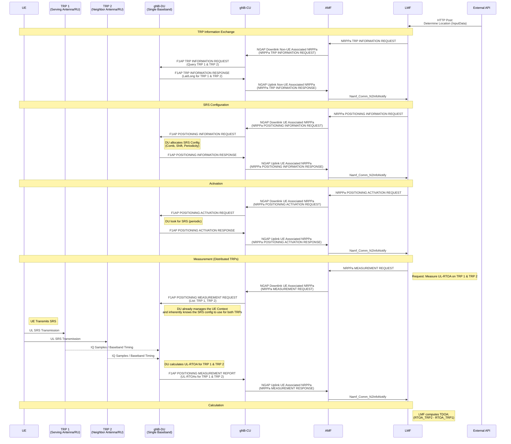

<!-- SPDX-License-Identifier: CC-BY-4.0 -->

The sequence diagram below illustrates the NRPPA Call Flow for Uplink Time Difference of Arrival (UL-TDOA) based positioning implemented in duranta.

Note that the current implementation is restricted to a single gNB with multiple antennas as a distributed antenna system, where each antenna acts as a Transmission and reception point (TRP).

