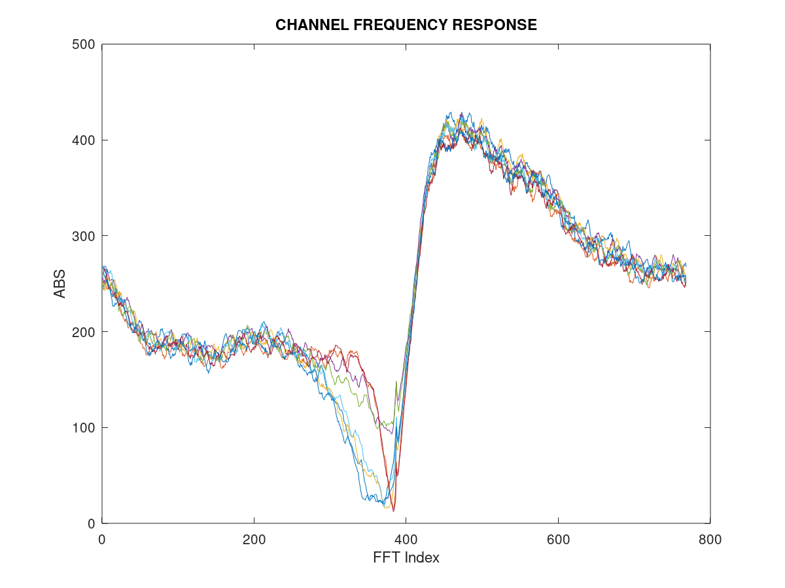
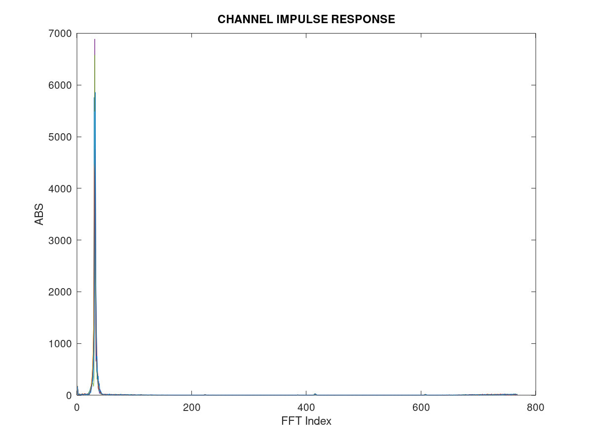

<!-- SPDX-License-Identifier: CC-BY-4.0 -->

# Running NR PRS with OAI gNB and nrUE

After you have [built the softmodem executables](BUILD.md), go to the build
directory `build/` and start testing the Rel16 PRS use cases.

## PRS parameters and config files

| **Mode**                     | **gNB config**                                                                       | **nrUE config**           |
|------------------------------|--------------------------------------------------------------------------------------|---------------------------|
| **FR1 40MHz<br>30kHz SCS**   | [gnb0.prs.band78.fr1.106PRB.usrpx310.conf](../targets/PROJECTS/GENERIC-NR-5GC/CONF/gnb0.prs.band78.fr1.106PRB.usrpx310.conf)<br>[gnb1.prs.band78.fr1.106PRB.usrpx310.conf](../targets/PROJECTS/GENERIC-NR-5GC/CONF/gnb1.prs.band78.fr1.106PRB.usrpx310.conf)  | [ue.nr.prs.fr1.106prb.conf](../targets/PROJECTS/GENERIC-NR-5GC/CONF/ue.nr.prs.fr1.106prb.conf) |
| **FR2 100MHz<br>120kHz SCS** | [gnb0.prs.band261.fr2.66PRB.usrpx310.conf](../targets/PROJECTS/GENERIC-NR-5GC/CONF/gnb0.prs.band261.fr2.66PRB.usrpx310.conf)<br>[gnb1.prs.band261.fr2.66PRB.usrpx310.conf](../targets/PROJECTS/GENERIC-NR-5GC/CONF/gnb1.prs.band261.fr2.66PRB.usrpx310.conf)  | [ue.nr.prs.fr2.66prb.conf](../targets/PROJECTS/GENERIC-NR-5GC/CONF/ue.nr.prs.fr2.66prb.conf)  |

In both the gNB and nrUE config files, the PRS parameters are configured under
the `prs_config` section. The nrUE can receive downlink PRS from multiple gNBs
simultaneously, so the nrUE config contains one `prs_config` section per gNB.
These parameters can be changed to suit your test scenario.

As of now, PRS **comb sizes 2 and 4** are supported and validated with an R&S
spectrum analyzer.

> Note: Muting is NOT supported yet.

A sample PRS configuration is shown below:

```
prs_config = (
{
  NumPRSResources       = 1;
  PRSResourceSetPeriod  = [20, 2];
  SymbolStart           = [7];
  NumPRSSymbols         = [6];
  NumRB                 = 106;
  RBOffset              = 0;
  CombSize              = 4;
  REOffset              = [0];
  PRSResourceOffset     = [0];
  PRSResourceRepetition = 1;
  PRSResourceTimeGap    = 1;
  NPRS_ID               = [0];
  MutingPattern1        = [];
  MutingPattern2        = [];
  MutingBitRepetition   = 1;
}
);
```

The nrUE config has `Active_gNBs` to specify the number of active gNBs
transmitting PRS simultaneously. Help strings for all PRS parameters are
documented in `openair2/COMMON/prs_nr_paramdef.h`.

> Note: PRS transmission and reception can only be validated in `phy-test` mode.

## gNB in `phy-test` mode

### FR1 test
Open a terminal on the host machine and execute the command below to launch the
gNB with **X310 USRPs**:

```
sudo ./nr-softmodem -E -O ../../../targets/PROJECTS/GENERIC-NR-5GC/CONF/gnb0.prs.band78.fr1.106PRB.usrpx310.conf --phy-test --gNBs.[0].min_rxtxtime 6 -D 0 -U 0
```

If **N310 USRPs** are used, run the above command **without the `-E` option**
(i.e. without the 3/4 sampling rate).

To run using the **rfsimulator**, execute the following command:

```
sudo ./nr-softmodem -O ../../../targets/PROJECTS/GENERIC-NR-5GC/CONF/gnb0.prs.band78.fr1.106PRB.usrpx310.conf --phy-test --gNBs.[0].min_rxtxtime 6 -D 0 -U 0 --rfsim --rfsimulator.[0].serveraddr 127.0.0.1
```
> Note: -D 0 -U 0 disables downlink and uplink data in the `phy-test` mode
### FR2 test
In FR2 mode, an RF beamforming module is needed to transmit the signal in the
mmWave frequency range. **X310 USRPs** can be used with a BasicTx daughtercard
to transmit the baseband signal at an intermediate frequency (IF); the RF
beamforming module then performs beamforming and the upconversion to FR2
frequencies. The IF can be specified using `if_freq` in the RU section of the
gNB config.

If no RF beamforming module is present, the gNB can still be launched with the
USRP alone to transmit at a supported `if_freq`:

```
sudo ./nr-softmodem -O ../../../targets/PROJECTS/GENERIC-NR-5GC/CONF/gnb0.prs.band261.fr2.66PRB.usrpx310.conf --phy-test --gNBs.[0].min_rxtxtime 6 -D 0 -U 0
```

To run using the **rfsimulator**, execute the following command:

```
sudo ./nr-softmodem -O ../../../targets/PROJECTS/GENERIC-NR-5GC/CONF/gnb0.prs.band261.fr2.66PRB.usrpx310.conf --phy-test --gNBs.[0].min_rxtxtime 6 -D 0 -U 0 --rfsim --rfsimulator.[0].serveraddr 127.0.0.1
```

### Multiple gNB scenario
PRS is primarily used for positioning and localization of the UE, with multiple
gNBs transmitting simultaneously. The OAI PRS implementation supports multi-gNB
transmission provided all gNBs are tightly synchronized using a GPSDO clock.
Therefore, before running this scenario, make sure the USRPs have a built-in
GPSDO and that the GPS antennas are connected with good satellite visibility.
Also, every time a gNB is launched, wait until `GPS LOCKED` is printed on the
terminal during gNB startup. If a USRP fails to lock to the GPSDO, try again
until it locks.

To use the GPSDO, change `clock_source` and `time_source` to `gpsdo` in the RU
section of the gNB config.

**FR1**

gNB0:

```
sudo ./nr-softmodem -E -O ../../../targets/PROJECTS/GENERIC-NR-5GC/CONF/gnb0.prs.band78.fr1.106PRB.usrpx310.conf --phy-test --gNBs.[0].min_rxtxtime 6 -D 0 -U 0
```

gNB1:

```
sudo ./nr-softmodem -E -O ../../../targets/PROJECTS/GENERIC-NR-5GC/CONF/gnb1.prs.band78.fr1.106PRB.usrpx310.conf --phy-test --gNBs.[0].min_rxtxtime 6 -D 0 -U 0
```

To run using the **rfsimulator**, execute the following commands:

gNB0:

```
sudo ./nr-softmodem -E -O ../../../targets/PROJECTS/GENERIC-NR-5GC/CONF/gnb0.prs.band78.fr1.106PRB.usrpx310.conf --phy-test --gNBs.[0].min_rxtxtime 6 -D 0 -U 0 --rfsim --rfsimulator.[0].serveraddr 127.0.0.1
```

gNB1:

```
sudo ./nr-softmodem -E -O ../../../targets/PROJECTS/GENERIC-NR-5GC/CONF/gnb1.prs.band78.fr1.106PRB.usrpx310.conf --phy-test --gNBs.[0].min_rxtxtime 6 -D 0 -U 0 --rfsim --rfsimulator.[0].serveraddr 127.0.0.1
```

> Note: In rfsim, the multiple gNBs are automatically synchronized using the
> system timestamp.

## nrUE in `phy-test` mode
When the gNB and nrUE run on the same host machine, the `reconfig.raw` and
`rbconfig.raw` files are generated with the launch of the gNB, and the nrUE then
sources them automatically from the build directory. However, if the gNB and
nrUE run on two different host machines, first run the gNB with the
corresponding config and exit after a few seconds. This generates the
`reconfig.raw` and `rbconfig.raw` files; copy them to the machine that runs the
nrUE.

> Note: If the UE is NOT able to connect to the gNB, check the USRP connections
> or try increasing `--ue-rxgain` in steps of 10 dB.

### FR1 test
Once the gNB is up and running, open another terminal and execute the command
below to launch the nrUE with **X310 USRPs**. Make sure to specify `IP_ADDR1`
and `IP_ADDR2` (optional) to match the USRP IP addresses:

```
sudo ./nr-uesoftmodem -E --phy-test --usrp-args "addr=IP_ADDR1,second_addr=IP_ADDR2,time_source=internal,clock_source=internal" -O ../../../targets/PROJECTS/GENERIC-NR-5GC/CONF/ue.nr.prs.fr1.106prb.conf --ue-rxgain 80 --ue-fo-compensation --non-stop
```

If **N310 USRPs** are used, run the above command **without the `-E` option**
(i.e. without the 3/4 sampling rate).

To run using the **rfsimulator** (UE as server), execute the following command:

```
sudo ./nr-uesoftmodem -E --phy-test -O ../../../targets/PROJECTS/GENERIC-NR-5GC/CONF/ue.nr.prs.fr1.106prb.conf --rfsim --rfsimulator.[0].serveraddr server
```

### FR2 test
Like the gNB, the RF beamforming module receives at mmWave frequencies, and
**X310 USRPs** with a BasicRx daughtercard receive the signal at the
intermediate frequency (IF) from the RF beamforming module. The IF can be
specified using the `--if_freq` option on the nrUE command line.

If no RF beamforming module is present, the nrUE can still be launched with the
USRP alone to receive at `if_freq` and perform validation. Make sure `if_freq`
is within the range supported by the USRP the nrUE is running with:

```
sudo ./nr-uesoftmodem --phy-test -O ../../../targets/PROJECTS/GENERIC-NR-5GC/CONF/ue.nr.prs.fr2.66prb.conf --usrp-args "addr=IP_ADDR1,second_addr=IP_ADDR2,time_source=internal,clock_source=internal" --ue-rxgain 80 --ue-fo-compensation --if_freq 50000000 --non-stop
```

To run using the **rfsimulator** (UE as server), execute the following command:

```
sudo ./nr-uesoftmodem --phy-test -O ../../../targets/PROJECTS/GENERIC-NR-5GC/CONF/ue.nr.prs.fr2.66prb.conf --rfsim --rfsimulator.[0].serveraddr server
```

### Understanding UE logs
Before testing, make sure that:

- In the nrUE PRS config file, `Active_gNBs` is set to the actual number of
  gNBs launched.
- The parameters in the `prs_config` sections of the nrUE config match those
  of the gNB config used.

Then launch the nrUE using one of the commands above, depending on the FR1/FR2
test scenario.

After a successful connection, the UE starts estimating the channel from the
downlink PRS pilots using the Least-Squares (LS) method. In the frequency
domain, linear interpolation reconstructs the channel over the entire PRS
bandwidth from the LS estimates at the pilot locations. The UE also measures the
Time of Arrival (ToA) from the time-domain impulse response. The ToA measurement
is printed on the console for each PRS resource.

The unit of ToA printed in the console is in samples. To convert the samples to
time in seconds (s), use the following equation,

`ToA (s) = ToA(samples) / sampling rate`

The UE logs can be seen as follows: 

FR1: 2 gNBs, 1 PRS resource per gNB

```
[PHY]    [gNB 0][rsc 0][Rx 0][sfn 433][slot 2] DL PRS ToA ==> 0.0 / 2048 samples, peak channel power -16.4 dBm, SNR +4.0 dB, rsrp -42.2 dBm
[PHY]    [gNB 1][rsc 0][Rx 0][sfn 433][slot 3] DL PRS ToA ==> 0.0 / 2048 samples, peak channel power -16.4 dBm, SNR +4.0 dB, rsrp -42.2 dBm
```
FR2: 1 gNB, 8 PRS resources

```
[PHY]    [gNB 0][rsc 0][Rx 0][sfn 689][slot 2] DL PRS ToA ==> 0.0 / 1024 samples, peak channel power -14.4 dBm, SNR +4.0 dB, rsrp -39.1 dBm
[PHY]    [gNB 0][rsc 1][Rx 0][sfn 689][slot 12] DL PRS ToA ==> 0.0 / 1024 samples, peak channel power -14.4 dBm, SNR +4.0 dB, rsrp -39.1 dBm
[PHY]    [gNB 0][rsc 2][Rx 0][sfn 689][slot 22] DL PRS ToA ==> 0.0 / 1024 samples, peak channel power -14.4 dBm, SNR +4.0 dB, rsrp -39.1 dBm
[PHY]    [gNB 0][rsc 3][Rx 0][sfn 689][slot 32] DL PRS ToA ==> 0.0 / 1024 samples, peak channel power -14.4 dBm, SNR +4.0 dB, rsrp -39.2 dBm
[PHY]    [gNB 0][rsc 4][Rx 0][sfn 689][slot 42] DL PRS ToA ==> 0.0 / 1024 samples, peak channel power -14.4 dBm, SNR +4.0 dB, rsrp -39.1 dBm
[PHY]    [gNB 0][rsc 5][Rx 0][sfn 689][slot 52] DL PRS ToA ==> 0.0 / 1024 samples, peak channel power -14.4 dBm, SNR +4.0 dB, rsrp -39.1 dBm
[PHY]    [gNB 0][rsc 6][Rx 0][sfn 689][slot 62] DL PRS ToA ==> 0.0 / 1024 samples, peak channel power -14.4 dBm, SNR +4.0 dB, rsrp -39.1 dBm
[PHY]    [gNB 0][rsc 7][Rx 0][sfn 689][slot 72] DL PRS ToA ==> 0.0 / 1024 samples, peak channel power -14.4 dBm, SNR +4.0 dB, rsrp -39.1 dBm
```
> Note : verify that peak channel power, SNR and rsrp have reasonable values

On the UE side, the T tracer dumps the PRS channel estimates in both the time
and frequency domains, using `UE_PHY_DL_CHANNEL_ESTIMATE` and
`UE_PHY_DL_CHANNEL_ESTIMATE_FREQ` respectively. These dumps can be enabled by
adding `--T_stdout 0` (without console prints) or `--T_stdout 2` (with console
prints) to the nrUE launch command above.

## Recording T tracer dumps
Once the nrUE is launched with the `--T_stdout 0` or `--T_stdout 2` option, open
another terminal, navigate to the T tracer directory `common/utils/T/tracer/`,
and build the T tracer binary using `make`.

Once the build is successful, execute the following command to start recording
the PRS channel-estimate dumps:

```
./record -d ../T_messages.txt -on LEGACY_PHY_INFO -on UE_PHY_DL_CHANNEL_ESTIMATE -on UE_PHY_DL_CHANNEL_ESTIMATE_FREQ -o prs_dumps.raw
```

Exit using `Ctrl+C` to stop recording; otherwise it will keep running and take
up a lot of disk space. Running it for 1-2 minutes generally collects sufficient
dumps.

To check the contents of a recorded `.raw` file, replay it by executing:

```
./replay -i prs_dumps.raw
```

and textlog it in another terminal with the following command:

```
./textlog -d ../T_messages.txt -ON
```

## Extracting PRS channel estimates
Once the T tracer dumps are recorded, the PRS channel estimates can be extracted 
from the `.raw` file using the bash script 
[extract_prs_dumps.sh](../common/utils/T/tracer/extract_prs_dumps.sh) in the T 
tracer directory `common/utils/T/tracer/`:

```
./extract_prs_dumps.sh -g <num_gnb> -n <num_resources> -f <recorded .raw file> -c <count>
```

For example: FR1 with 2 gNBs, 1 PRS resource per gNB and 100 samples:

```
./extract_prs_dumps.sh -g 2 -n 1 -f prs_dumps.raw -c 100
```

For example: FR2 with 1 gNB, 8 PRS resources (rsc 0 to 7) and 100 samples:

```
./extract_prs_dumps.sh -g 1 -n 8 -f prs_dumps.raw -c 100
```

In the end, the script zips all the extracted dumps into `prs_dumps.tgz`. Check
the script's help with the `-h` option:

```
./extract_prs_dumps.sh -h
```

## MATLAB/Octave script to visualize PRS channel estimates
We have developed the 
[plot_prs_Ttracer_dumps.m](../common/utils/T/tracer/plot_prs_Ttracer_dumps.m) 
script to visualize the extracted PRS dumps offline in MATLAB/Octave. The 
script is located at `common/utils/T/tracer/`.

Enter the parameters the script asks for as input, like below:

```
Enter the directory path to T tracer dumps: '<workspace>/openairinterface5g/common/utils/T/tracer'
Enter the OFDM FFT size used for file parsing: <frame_parms->ofdm_symbol_size>
Enter number of PRS resources: <NumPRSResources>
Enter number of active gNBs: <Active_gNBs>
```

This script reads the IQ data from the extracted PRS dumps (`chF_gnbX_Y.raw` and
`chT_gnbX_Y.raw`) and plots them as shown below:




