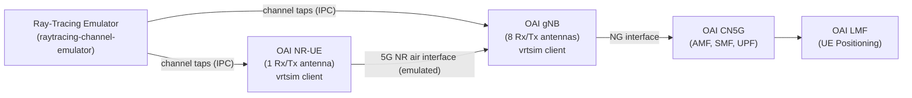

<!-- SPDX-License-Identifier: CC-BY-4.0 -->

# UE positioning in a Digital Twin using Ray-Tracing Channel Emulator with OAI 5G Stack

**Table of Contents**

[[_TOC_]]

## 1. Overview

This tutorial describes how to localize a UE in a digital twin using ray-tracing
channel emulator with OAI 5G stack:

- **3D Ray-Tracing Channel Emulation**: a ray-tracing propagation simulator
  that generates realistic multipath channel taps from a environment model.
- **OAI 5G NR Stack**: the OpenAirInterface gNB (8 antennas Tx/Rx) and NR-UE
  (1 antenna Tx/Rx), connected to the ray-tracing emulator via the `vrtsim`
  radio device.
- **OAI CN5G Core Network**: a dockerized 5G core including AMF, SMF, UPF, and
  a custom LMF (Location Management Function) for UE positioning.

The end-to-end setup enables a full 5G SA connection from the UE to the core
network, including UE location estimation via the LMF.



## 2. Architecture

### 2.1 System Components

The digital twin consists of three independent subsystems that must all be
running simultaneously:

**Ray-Tracing Channel Emulator** acts as the central channel simulator. It reads
a scene configuration from a 3D environment, runs ray-tracing to compute
multipath propagation taps, and distributes these taps over IPC sockets to the
gNB and UE.

**OAI RAN** uses the `vrtsim` radio device plugin instead of real RF hardware.
The gNB connects as a server on one IPC socket and the UE connects as a client
on another. The vrtsim driver consumes the channel taps produced by the emulator
to simulate the over-the-air channel.

**OAI CN5G** is the 5G core network running in Docker containers. It includes
the standard NFs (AMF, SMF, UPF, NRF, AUSF, UDM, UDR) along with the LMF, which
supports UE location estimation via the `nlmf-loc` API.

### 2.2 IPC Socket Topology

```
raytracing-channel-emulator (main.py)
        |
        |--- ipc:///tmp/ru_socket_0  ---->  gNB (vrtsim server)
        |
        |--- ipc:///tmp/ue_socket_0  ---->  UE  (vrtsim client)
```

## 3. Prerequisites

### 3.1 Hardware Requirements

- **Server / Workstation** (recommended):
  - OS: Ubuntu 22.04 or 24.04 LTS
  - CPU: x86_64, >= 8 cores @ >= 3.5 GHz
  - RAM: >= 32 GB
  - No RF hardware required (channel is fully emulated)

### 3.2 Software Requirements

- Docker and Docker Compose (for CN5G)
- Python 3.8+ with pip (for the ray-tracing emulator)
- OAI build dependencies (CMake, gcc, etc.)
- Git

## 4. Cloning the Repositories

Clone all three repositories and check out the correct branches.

### 4.1 OAI RAN

The OAI RAN clone and checkout are handled as part of the build steps in Section
5.2.

### 4.2 Ray-Tracing Channel Emulator

```bash
git clone https://gitlab.eurecom.fr/oai/raytracing-channel-emulator.git
cd raytracing-channel-emulator
git checkout origin/eurecom_simulation_godot_integration
```

## 5. Building the Components

### 5.1 Ray-Tracing Channel Emulator

Prepare the environment:
```
cd ~/raytracing-channel-emulator
~/raytracing-channel-emulator$ python3 -m venv myvenv
~/raytracing-channel-emulator$ source myvenv/bin/activate
~/raytracing-channel-emulator$ cd server
~/raytracing-channel-emulator/server$ pip install -r requirements.txt
```

Generate flatbuffers serializer/deserializer:

```
~/raytracing-channel-emulator/server$ flatc --python api/taps.fbs
```

Refer to the setup instructions in the emulator's own
[README](https://gitlab.eurecom.fr/oai/raytracing-channel-emulator/-/blob/develop/server/README.md)
for further information

### 5.2 OAI gNB and NR-UE

```
# Get openairinterface5g source code
git clone https://github.com/duranta-project/openairinterface5g.git ~/openairinterface5g
cd ~/openairinterface5g

# Install OAI dependencies
cd ~/openairinterface5g/cmake_targets
./build_oai -I

# nrscope dependencies
sudo apt install -y libforms-dev libforms-bin

# Build OAI gNB and NR-UE with vrtsim taps client enabled
cd ~/openairinterface5g/cmake_targets
./build_oai -w USRP --ninja --nrUE --gNB --build-lib "nrscope" -C --cmake-opt -DOAI_VRTSIM_TAPS_CLIENT=ON
```

> **Note:** The `-DOAI_VRTSIM_TAPS_CLIENT=ON` CMake option enables the vrtsim
> taps client, which is required for receiving channel taps from the ray-tracing
> emulator.

### 5.3 OAI CN5G Docker Images

#### Pull standard CN5G images

```
cd ~/openairinterface5g/doc/tutorial_resources/oai-cn5g
docker compose pull -f docker-compose-positioning.yaml
```

## 6. Running the Setup

>** IMPORTANT **
>
>Launch order matters. Always start components in the order listed below, and
>wait for each one to be ready before starting the next.

```
1. OAI CN5G   (core network)
2. OAI gNB
3. OAI NR-UE
4. Ray-Tracing Channel Emulator
5. Measurement (after PDU session is established)
```

### 6.1 Start OAI CN5G

```
cd ~/openairinterface5g/doc/tutorial_resources/oai-cn5g
docker-compose -f docker-compose-positioning.yaml up -d
```

Verify all containers are healthy:

```
docker ps -a
```

You should see AMF, SMF, UPF, NRF, AUSF, UDM, UDR, and LMF containers in
`Up (healthy)` state.

### 6.2 Start the gNB

```
cd ~/openairinterface5g/cmake_targets/ran_build/build

sudo ./nr-softmodem \
  -O ../../../ci-scripts/conf_files/gnb.sa.band78.106prb.vrtsim.positioning.conf \
  --gNBs.[0].min_rxtxtime 6 \
  --device.name vrtsim \
  --vrtsim.role server \
  --vrtsim.taps-socket ipc:///tmp/ru_socket_0 \
  --vrtsim.timescale 0.08
```

Key parameters:

| Parameter | Description |
|-----------|-------------|
| `--device.name vrtsim` | Use the virtual radio device (no RF hardware) |
| `--vrtsim.role server` | gNB acts as the vrtsim server endpoint |
| `--vrtsim.taps-socket ipc:///tmp/ru_socket_0` | IPC socket for receiving channel taps |
| `--vrtsim.timescale 0.08` | Time acceleration factor for the simulation |
| `--gNBs.[0].min_rxtxtime 6` | Minimum Rx-to-Tx processing time in slots |

### 6.3 Start the NR-UE

```
cd ~/openairinterface5g/cmake_targets/ran_build/build

sudo ./nr-uesoftmodem \
  -C 3619200000 \
  -r 106 \
  --band 78 \
  --numerology 1 \
  --ssb 516 \
  --device.name vrtsim \
  --vrtsim.taps-socket ipc:///tmp/ue_socket_0 \
  -O ../../../targets/PROJECTS/GENERIC-NR-5GC/CONF/ue.conf
```

Key parameters:

| Parameter | Description |
|-----------|-------------|
| `-C 3619200000` | Carrier frequency: 3619.2 MHz (Band n78) |
| `-r 106` | Number of downlink resource blocks |
| `--numerology 1` | Subcarrier spacing: 30 kHz (mu=1) |
| `--ssb 516` | SSB subcarrier offset |
| `--device.name vrtsim` | Use the virtual radio device |
| `--vrtsim.taps-socket ipc:///tmp/ue_socket_0` | IPC socket for receiving channel taps |

### 6.4 Start the Ray-Tracing Channel Emulator

Activate the virtual environment, then launch the emulator:

```
source myvenv/bin/activate
cd ~/raytracing-channel-emulator/server
python main.py scenes/EURECOM/example_config.yaml
```

The emulator will load the EURECOM 3D scene, compute ray-tracing propagation
paths, and begin pushing channel taps to the gNB and UE over their respective
IPC sockets.

## 7. UE Positioning Measurement

Once the PDU session is established, trigger a positioning measurement via the
LMF REST API. The LMF will collect measurements from the RAN and return the
estimated UE coordinates.

### 7.1 Prepare the Input Data

Create a file `InputData.json` with the positioning request body conforming to
3GPP TS 29.572 (`InputData` schema) and place it in
`~/openairinterface5g/doc/tutorial_resources/oai-cn5g/`.

### 7.2 Send a Positioning Request

```
cd ~/openairinterface5g/doc/tutorial_resources/oai-cn5g/positioning
curl --http2-prior-knowledge \
  -H "Content-Type: application/json" \
  -d "@InputData.json" \
  -X POST http://192.168.70.141:8080/nlmf-loc/v1/determine-location
```

The LMF will respond with the estimated UE coordinates derived from measurements
collected through the OAI RAN and the ray-tracing channel model.

## 8. Stopping the Setup

Stop components in reverse order to ensure a clean shutdown:

```
# 1. Stop the ray-tracing emulator (Ctrl+C in its terminal)

# 2. Stop the NR-UE (Ctrl+C in its terminal)

# 3. Stop the gNB (Ctrl+C in its terminal)

# 4. Stop CN5G
cd ~/openairinterface5g/doc/tutorial_resources/oai-cn5g
docker-compose -f docker-compose-positioning.yaml down -t 0
```

## 9. Troubleshooting

**UE cannot synchronize with gNB**

Make sure the gNB is fully started before launching the UE. If IPC sockets are
stale from a previous run, remove them before restarting:

```
rm -f /tmp/ru_socket_0 /tmp/ue_socket_0
```

Also verify the SSB offset (`--ssb 516`) and carrier frequency (`-C 3619200000`)
match the values in the gNB configuration file.

**CN5G containers fail to start or are unhealthy**

Tear down any previous instance completely before restarting:

```
docker-compose -f docker-compose-positioning.yaml down -t 0
```

**LMF returns an error on the positioning request**

Confirm the PDU session is established before sending the curl request. Check
LMF container logs for details:

```
docker logs oai-lmf
```
