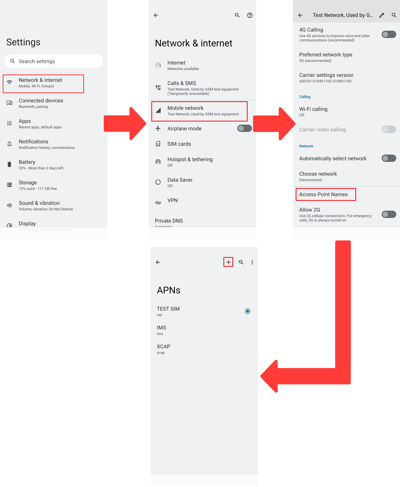
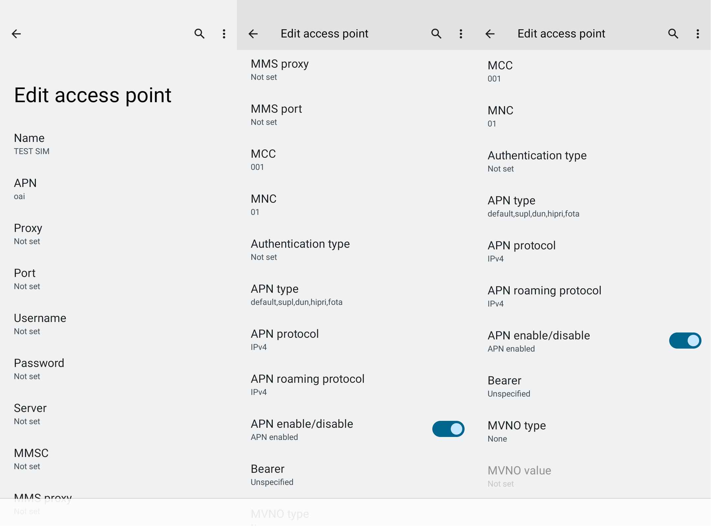
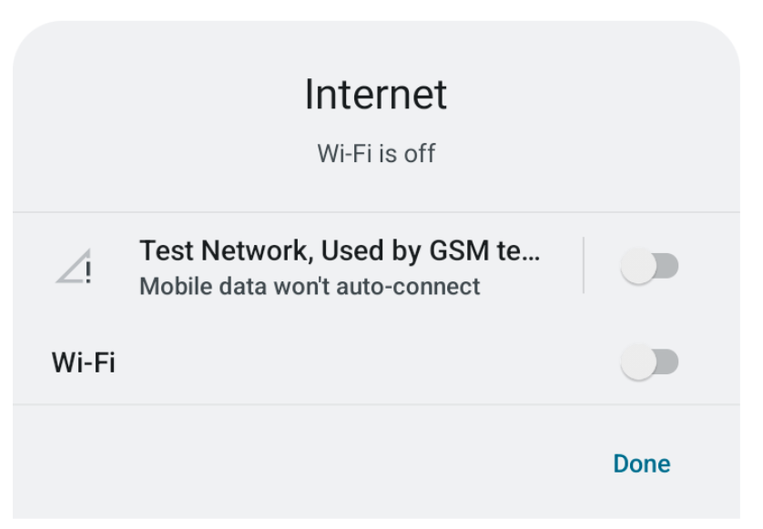
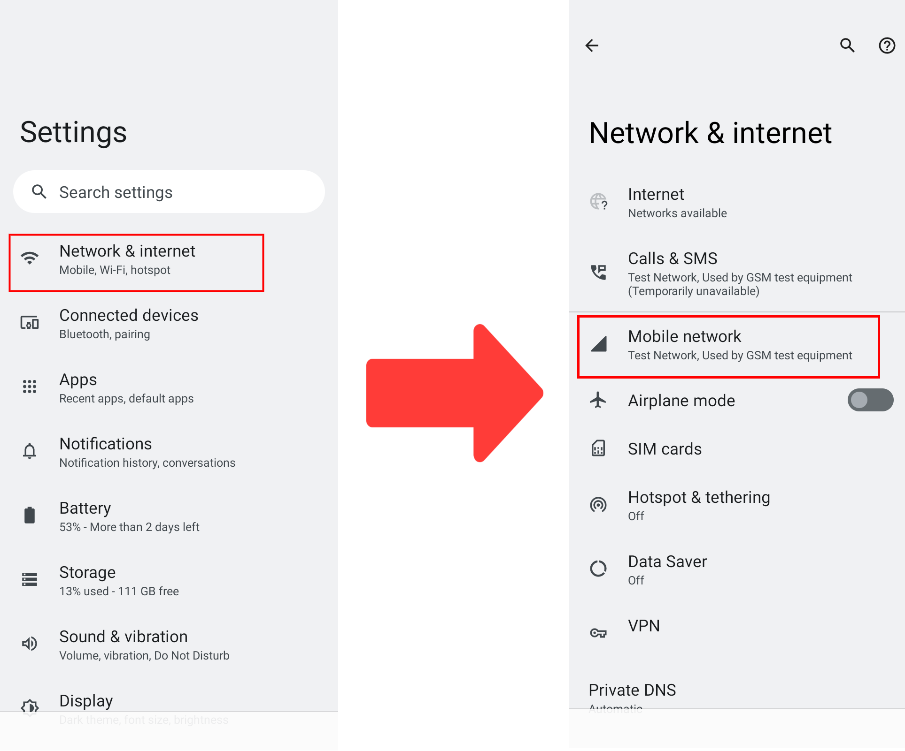
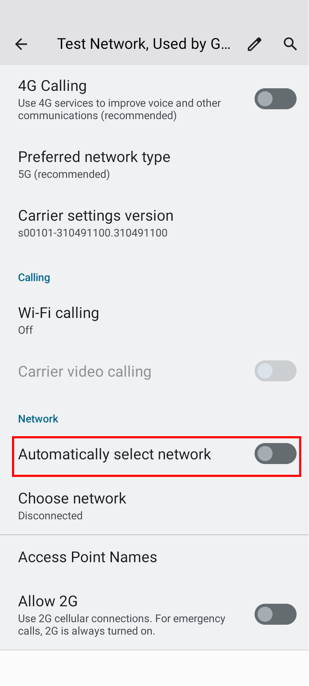
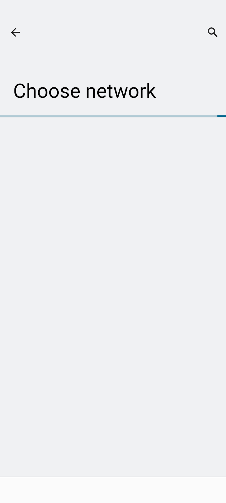
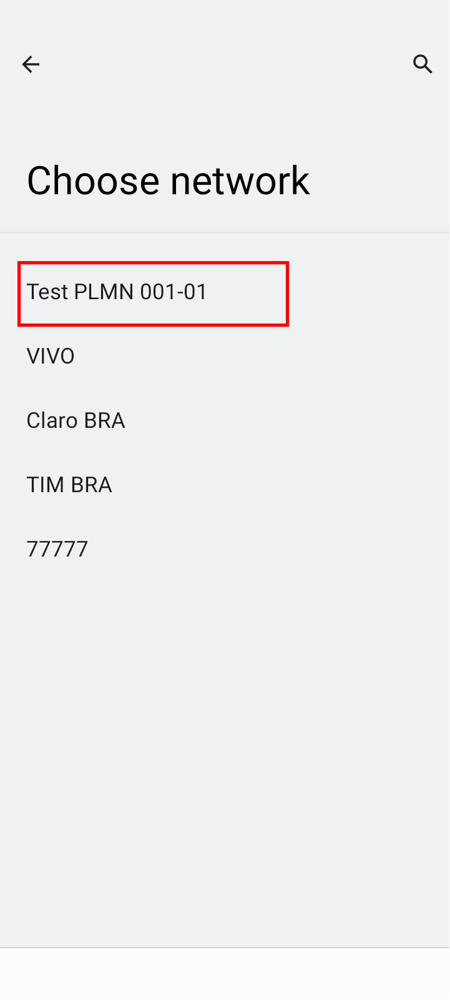

# Configuration of User Equipment
This tutorial covers how to use the previously configured SIM Card on the Motorola G50.

### Step 1: Insert the SIM in the UE (Motorola G50) 
In this step you must insert the SIM card into your cell phone, so that we can continue with the settings in order to make it possible to connect the device to the gNB.

### Step 2: Configure the UE (Motorola G50)
In this part, you will set the parameters to connect the OAI RAN 5G to the Motorola G50. Therefore, you will create the APN according to the images below. Once this is done, you will need to choose the APN created.

 
Figure 1: step by step to open the APN configuration menu.

:exclamation: **Now you must configure the parameters as shown in the figure below.**

 
Figure 2: configuration parameters.

### Step 3: Real UE deployment (Motorola G50) (after 5GC and gNB deployment)
In this step, you must disable the smartphone's internet, as shown in the figure below

 
Figure 3: Wi-fi off image.

 
Figure 4: Wi-fi off image.

Now let's disable the "Automatically select network" option, to do this follow the steps shown in figure 8.

 
Figure 5: Disable automatically select network.

After completing the previous step, the smartphone will start searching for new networks. Bearing this in mind, this step may take approximately 5 minutes to identify any available networks.

 
Figure 6: smartphone searching network.

After the search is complete, the smartphone will display a screen similar to figure 10. At this point, you must select the "TEST PLMN 001-01" network and try to establish an internet connection.

 
Figure 7: Available networks.

By following the steps presented in this tutorial, developers will be able to set up a development environment to work with SIM cards on Linux.
more informations: https://www.sysmocom.de/manuals/sysmousim-manual.pdf
