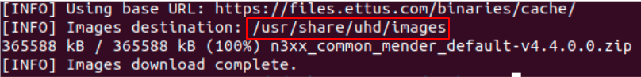

# USRP N310 installation 

Before proceeding with the installation, check the following points:

* Connect the USRP N310 into power 
* Connect the SFP+ adapter to port SFP+	0 in USRP N310
* Connect the USRP N310 to port ethernet or an SPF+ port in the PC

## Step 1: Network configuration

By default, the IP addresses of the ports SFP+ 0 and SFP+ 1 of USRP N310 are 192.168.10.2/24 and 192.168.20.2/24, respectively. Moreover, the port SFP+ 0 operates in max gigabit, and the port SFP+ 1 can operate in ten gigabit.

Run the command below to configure the USRP network to the port SFP+ 0:
```bash
sudo ip addr add 192.168.10.1/24 dev <ETHERNET_INTERFACE_NAME>
```

In order to test your connectivity with USRP N310 in the port SFP+ 0, run the command below:
```bash
ping 192.168.10.2 
```

## Step 2: Verify UHD library version

On the host PC, run the command below to verify UHD library version:
```bash
uhd_usrp_probe –-version 
```

That version must be the same of the UHD library version on the USRP N310, then run the commands below to access the USRP N310 and verify the UHD library version:
```bash
ssh root@192.168.10.2 
uhd_usrp_probe –-version 
```

If the UHD library version is the same on the host PC and the USRP, the installation is complete. If the versions are different, proceed to the next steps to update the version on the USRP.

# Updating the USRP libuhd (optional) 

## Step 1: Download the USRP image

On the host PC, run the command below:
```bash
sudo uhd_images_downloader -t mender -t n3xx --yes
```

## Step 2: Send UHD image file to USRP
When the download is complete, check the destination location, as in the image below:


Next, go to directory of downloaded file (in this case /usr/share/uhd/images) and run the command below to send the UHD image file to the USRP:
```bash
scp <image_file> root@192.168.10.2:~
```

## Step 3: Install the new version of the UHD library

Run the commands below to access the USRP and install the new version of the UHD library:
```bash
ssh root@192.168.10.2
mender -f -rootfs usrp_n3xx_fs.mender install
```

## Step 4: Reboot USRP

Run the command below:
```bash
reboot
```

After reboot, run the command below to save changes:
```bash
mender --commit
```

# More information about USRP N310

* To shutdown the USRP, use the command `init 0`
* Features and test with OpenAirInterface: [OAI Reference Architecture for 5G and 6G Research with USRP - Ettus Knowledge Base](https://kb.ettus.com/OAI_Reference_Architecture_for_5G_and_6G_Research_with_USRP)
