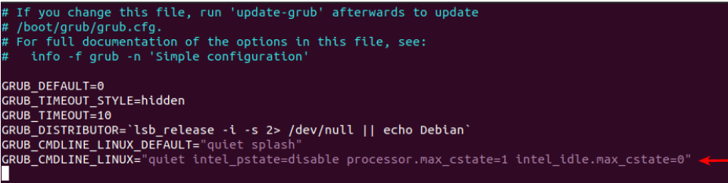
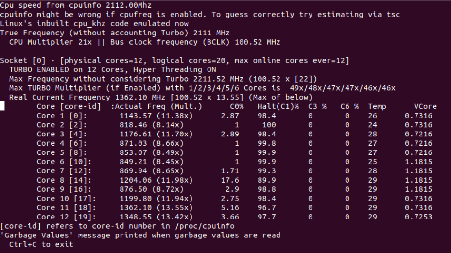

# Performance Mode

## General Instructions
This module consists of changing your desktop power mode to perfomance mode. The main goal of this configuration is to enable OAI use all the desktop's resources needed without restrictions.

Based on: [OpenAirKernelMainSetup · Wiki · oai / openairinterface5G · GitLab (eurecom.fr)](https://gitlab.eurecom.fr/oai/openairinterface5g/-/wikis/OpenAirKernelMainSetup).

New commands can be found in [doc/NR_SA_Tutorial_COTS_UE.md · develop · oai / openairinterface5G · GitLab (eurecom.fr)](https://gitlab.eurecom.fr/oai/openairinterface5g/-/blob/develop/doc/NR_SA_Tutorial_COTS_UE.md), but **not tested yet**.

### Step 1: Configuration of the linux kernel
The goal of this section is to guide step-by-step how to set up the linux environment for the performance mode.

To download and enable the low-latency kernel as in [Environment installation](../../README.md):

#### Step 1.2 Removing all power management
We need to disable specific power management features in the BIOS, such as sleep states, especially `C-states`, in order to enhance the
machine's performance. C-states refer to different energy-saving modes available for the CPU. In this subsection, we will configure the CPU to
operate in a mode that utilizes 100% of its power:
1. In `/etc/default/grub`, add `quiet intel_pstate=disable` and `processor.max_cstate=1 intel_idle.max_cstate=0` to `GRUB_CMDLINE_LINUX_DEFAULT`, as in:
```bash
GRUB_CMDLINE_LINUX="quiet intel_pstate=disable processor.max_cstate=1 intel_idle.max_cstate=0"
```
<p align="center"></br>
Figure 1: New lines add in grub.</p>

2. Use `sudo update-grub` for update the grub:
```bash
sudo update-grub
```

3. In `/etc/modprobe.d/blacklist.conf`, add line `blacklist intel_powerclamp`:
```bash
blacklist intel_powerclamp
```
Obs: if the file does not exist, create one, and add the line into it!

4. Install i7z:
```bash
sudo apt-get install i7z
```
5. Reboot the system.

6. Use the command:
```bash
sudo i7z
```

After completing these steps, Linux will display a result similar to figure below, where the C0% or C1% values will be close to 100%. The C0 state represents the CPU being fully active and actively executing instructions. On the other hand, the C1 state signifies the CPU being fully active but idle, waiting for instructions.
<p align="center"></br>
Figure 2: i7z output.</p>

#### Step 2.3 Disabling CPU Frequency scaling
1. Use:
```bash
sudo apt-get install cpufrequtils
```
2. Write `GOVERNOR="performance"` in `/etc/default/cpufrequtils`.
Obs: if the file does not exist, create one, and add the line into it !

3. Restart cpufrequtils
```bash
sudo /etc/init.d/cpufrequtils restart
```

4. Check if all core are in perfomance mode with the command:
```bash
cpufreq-info
```

To change back to powersave mode, you need to use `sudo cpufreq-set -c X -g on demand` , where `X` is the number of which CPU.