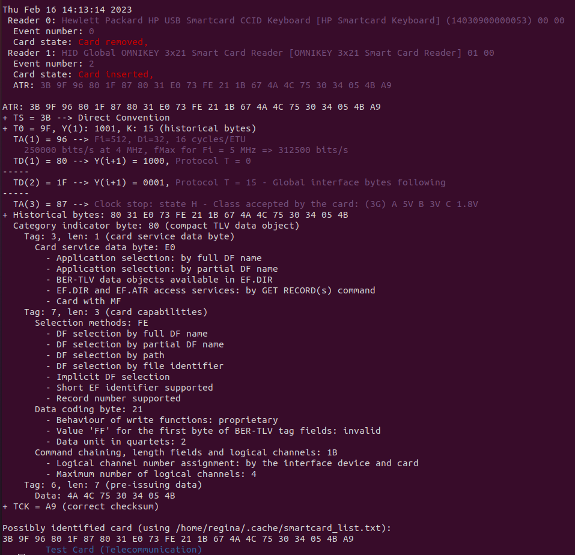
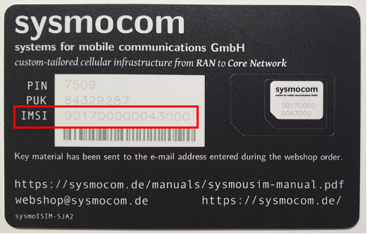

# Installation and configuration of the Sysmocom development environment
This tutorial covers the process of installing and configuring a development environment for sysmocom SIM cards on the Linux operating system.

## installation and configuration of dependencies
### Step 1: System update:
To begin with, it is important to ensure that the operating system is up to date. Use the following command to perform the update:

```bash
sudo apt-get update -y
```
  
### Step 2: Basic Tools Installation:
Install the basic tools necessary to interact with SIM cards using the commands below:

```bash
sudo apt-get install -y pcsc-tools
sudo apt-get install pcscd systemd
```

### Step 3: Configuring the pcscd Service:
Enable and start the pcscd service to ensure the system is ready to interact with SIM cards:

```bash
sudo systemctl enable pcscd.socket
sudo systemctl start pcscd.socket
```

### Step 4: Installation of the pcsclite-dev Library:
The libpcsclite-dev library is necessary for developing applications that interact with SIM cards. Install it using the following command:

```bash
sudo apt-get install -y libpcsclite-dev 
```

### Step 5: SWIG Tool Installation:
The SWIG tool is used to generate programming interfaces for different languages. Install it with the following command:

```bash
sudo apt-get install swig
```

### Step 6: Installation of Python Libraries:
Install the necessary Python libraries to interact with SIM cards:
```bash
pip install pyscard
pip install pytlv
```

### Step 7: Git clone the configuration files
After preparing the environment in your operating system, we must download the Sysmocom configuration files, to do this run the following command
```bash
git clone https://github.com/sysmocom/sysmo-usim-tool
```

### Step 8: Insert SIM Card into the reader
In this part you will insert the sysmocom SIM Card in the sysmocom reader. After, connect the USB cable to the PC.
<p align="center"></br>
Figure 1: Sysmocom SIM Card and Sysmocom reader.</p>

### Step 9: Verify the SIM Card information
In this part you will check the status and information of the SIM card, to do this run the following command.
```bash
pcsc_scan  
```
After executing the command, a result similar to that in figure 2 is expected.
<p align="center"></br>
Figure 2: Expected results for step 9.
</p>

### Step 10: Configure the SIM Card
In this step you will identify the IMSI printed on the sysmocom SIM card. To do this, simply look at your SIM card and identify the IMSI number as shown in figure 3.
<p align="center"></br>
Figure 3: IMSI in the sysmocom.</p>

### Step 11: Find the ADM1 parameter
In this step, you will search for the ADM1 parameter associated with the SIM card in the sysmocom details file. To do this, enter the file with information about your SIM card and search for IMSI. By doing this, you will identify ADM1.

:warning: **Attention, each SIM card has its own information**, look for the information on your SIM Card.

### Step 12: Configure the IMSI, KEY and OPC parameter in SIM Card
:warning: **IMPORTANT:** `If you miss 3 times the ADM1 value`, you will **BLOCK** the SIM Card. Pay attention to each command.

If you are following our tutorial, the IMSI, KEY and OPC values will be as follows:
```
imsi = 001010000000001
key  = fec86ba6eb707ed08905757b1bb44b8f
opc  = c42449363bbad02b66d16bc975d77cc1
```

After retrieving the IMSI, KEY and OPC value, you can execute the following commands to configure the IMSI, KEY and OPC on the SIM card. To do this, we will first enter the repository directory that was cloned from github, typing the following command:

```bash
cd sysmocom
```

Now, within the sysmocom directory, you will register each piece of information, we will start with IMSI, to do this, type the following command, replacing the `ADM1_value` and `IMSI_NUMBER` fields with the respective value obtained previously:
```bash
./sysmo-isim-tool.sja2.py -a ADM1_value -J IMSI_NUMBER
```

Now let's register the KEY, to do this, you must type the following command, remembering to change `ADM1_value` and `KEY_NUMBER`, with the respective values obtained previously:
```bash
./sysmo-isim-tool.sja2.py -a ADM1_value -K KEY_NUMBER
```

Finally, now let's register the OPC_NUMBER, to do this, you must type the following command, remembering to change `ADM1_value` and `OPC_NUMBER`, with the respective values obtained previously:
```bash
./sysmo-isim-tool.sja2.py -a ADM1_value -C OPC_NUMBER
```

Having done this procedure so far, we have our SIM card configured and ready to be used in a UE.