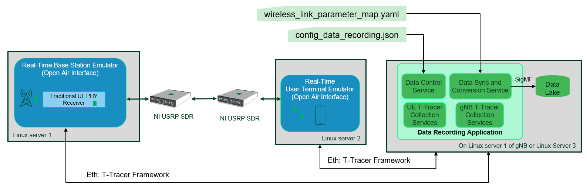
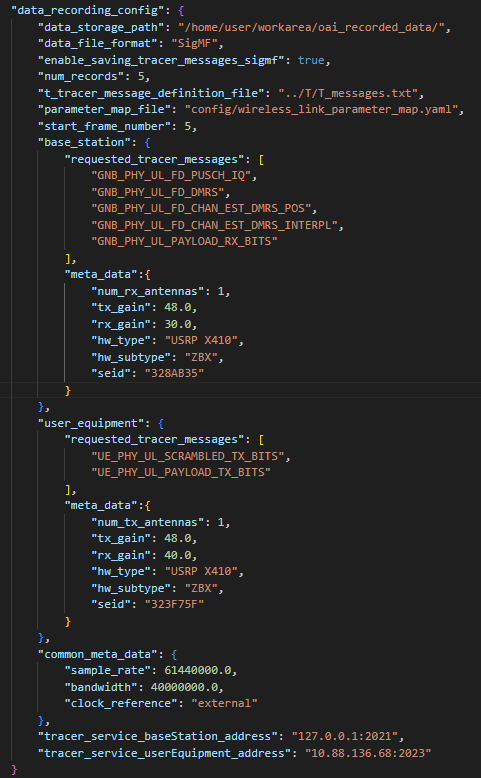
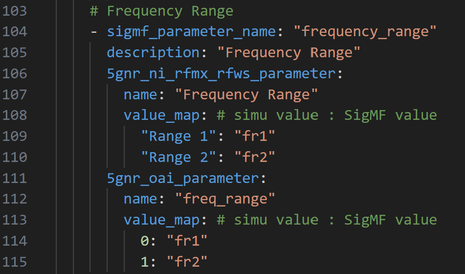
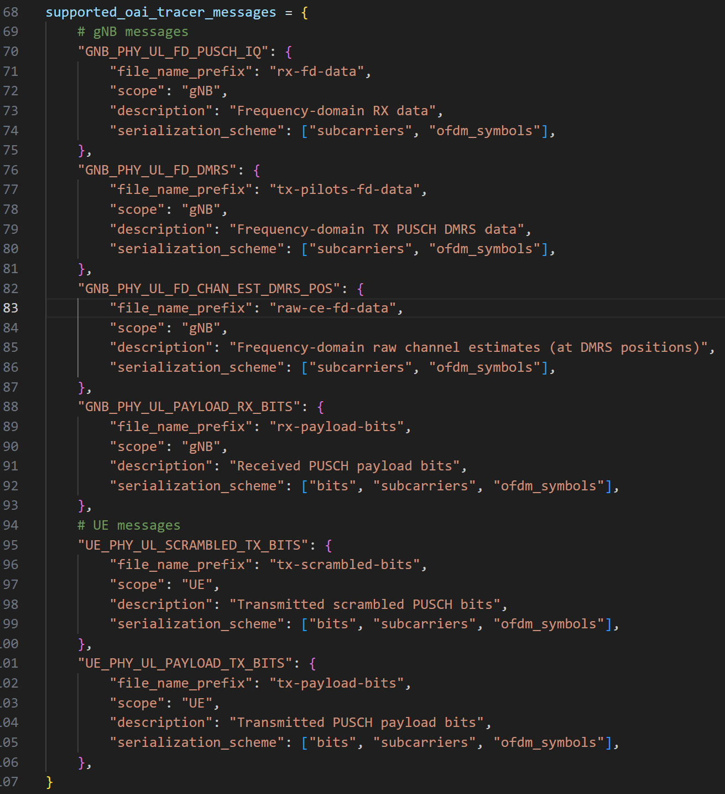
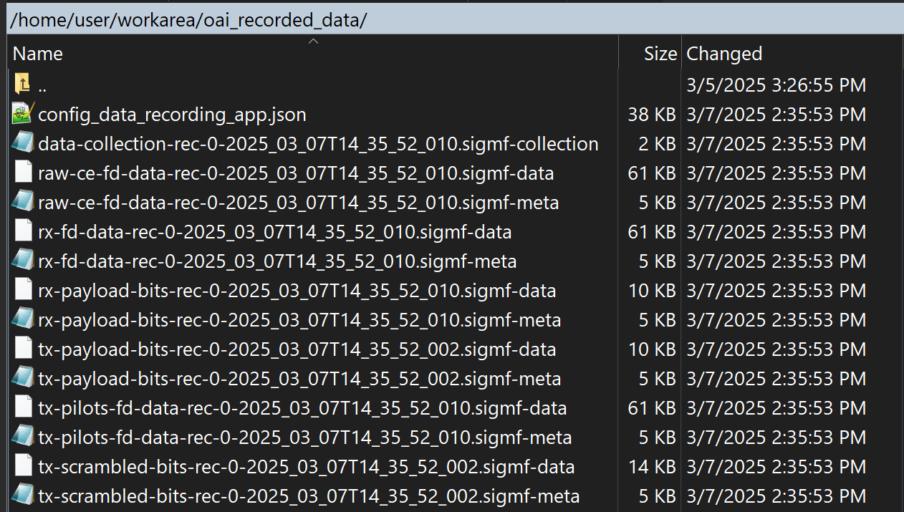
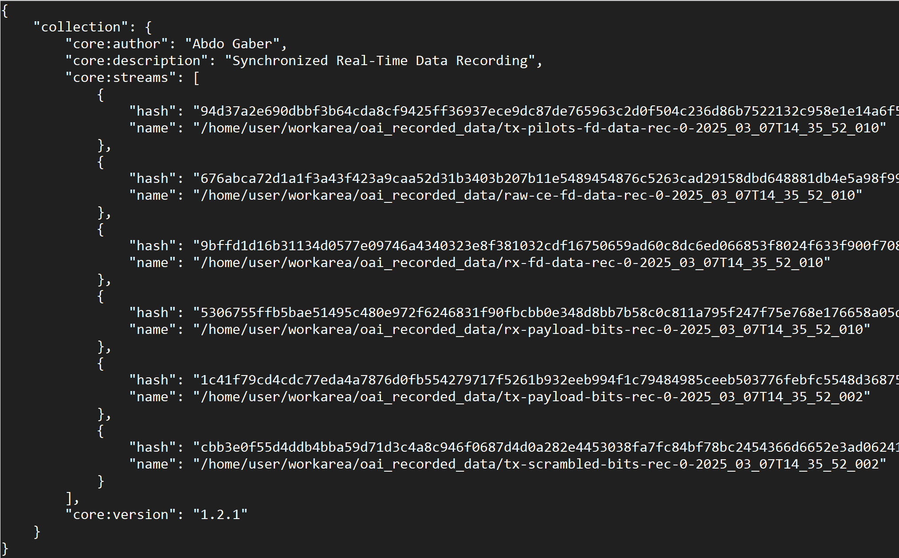
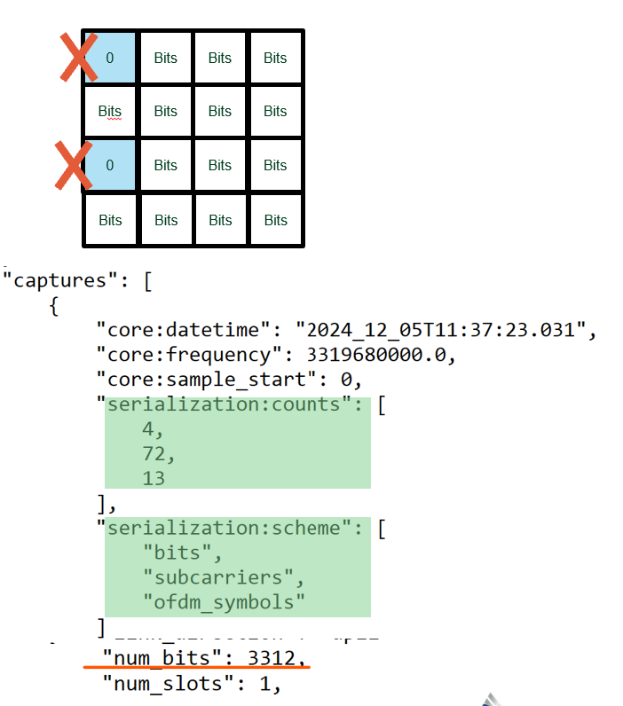

# Synchronized Real-Time Data Recording Application
 
The Data Recording Application runs in parallel to the system components on one of the LINUX servers. It makes use of OAI T-tracer framework. It is able to communicate with the Base station (gNB) and User terminal (UE).
In addition, it synchronizes and combines data traces and control information (metadata) from Base station and User terminal into consistent [Signal Metadata Format (SigMF) format](https://github.com/gnuradio/SigMF) data sets. SigMF is an open-source standard that specifies a way to describe sets of recorded digital signal samples with metadata (data properties and scenario descriptions) provided in [JSON](http://www.json.org/) files. The recorded data sets can be used for various research and application areas.  

## Data Recording Application Architecture 

Data Recording Application designed to have multiple services in different simulation environments: 
- Data Control Service (Python)
- Data collection (T-Tracer) Service (C)
- Data Conversion Service (Python)

Regarding to the APIs between different services, they are such as the following: 
- Data Control Service &rarr; Data Collection (T–Tracer) Service: The API is based on a shared memory.
- Data Collection (T–Tracer) Service &rarr; 5G NR Stack: T-Tracer Framework, ethernet connection.
- Data Collection (T–Tracer) Service &rarr; Data Conversion Service: The API is based on a shared memory.

The following figure shows OAI gNB and UE with the Data Recording App system architecture. 



## Requirement Packages
The following packages are required:
- `sudo apt-get install -y python3-sysv-ipc`
- `sudo apt-get install libxft-dev`
- `sudo python3 -m pip install sigmf==1.2.1`
- `sudo python3 -m pip install termcolor`
- `sudo python3 -m pip install bitarray`
- `sudo python3 -m pip install pandas`
- `sudo python3 -m pip install numpy==1.23`

## Configuration Files
### Main Data Recording JSON Configuration File
The Data Recording application provides configuration file in [JSON](http://www.json.org/) format. It is stored in [common/utils/data_recording/config/config_data_recording.json](../common/utils/data_recording/config/config_data_recording.json) folder. The main parameters are:
- **data_storage_path**: Path to directory for data storage
- **num_records**: Number of requested data records in slots
- **t_tracer_message_definition_file**: T-Tracer message definition file
- **parameter_map_file**: Parameter mapping dictionary (OAI parameters to standardized metadata). It is located here: [common/utils/data_recording/config/wireless_link_parameter_map.yaml](../common/utils/data_recording/config/wireless_link_parameter_map.yaml) 
- **start_frame_number**: It can be used to start the recording from a specific frame, but it is not yet supported.
- **base_station**:
    - requested_tracer_messages: Requested base station data traces. The supported messages are:
        - GNB_PHY_UL_FD_PUSCH_IQ
        - GNB_PHY_UL_FD_DMRS
        - GNB_PHY_UL_FD_CHAN_EST_DMRS_POS
        - GNB_PHY_UL_FD_CHAN_EST_DMRS_INTERPL
        - GNB_PHY_UL_PAYLOAD_RX_BITS
    - meta_data: Additional base station metadata (additional fixed base station parameters that cannot be read from the system yet, but shall be included into the SigMF metadata)
- **user_equipment** 
    - requested_tracer_messages: Requested user equipment data traces. The supported messages are:
        - UE_PHY_UL_SCRAMBLED_TX_BITS
        - UE_PHY_UL_PAYLOAD_TX_BITS
    - meta_data: Additional user equipment metadata (additional fixed UE parameters that are not read from the system yet, but shall be included into the SigMF metadata)
- **common_meta_data**: Common metadata parameters that are not read from the system yet, but shall be included into the SigMF metadata such as the sampling rate, the bandwidth, and the clock reference of USRP.
- **tracer_service_baseStation_address**: The IP address and port number of base station server. If the Data Recording App and the Data Collection (T–Tracer) Service are running on the same server of base station, the IP address and port number are : `127.0.0.1:2021`
- **tracer_service_userEquipment_address**: The IP address and port number of UE server.

**Notes**:
- The data can be recorded from base station and UE or from base station only or UE only. To disable the recording from any station, make the list of `requested_tracer_messages` empty such as: `requested_tracer_messages:[]`

The figure below illustrates an example of a JSON Data Recording App configuration file.



### Wireless Link Parameter Map Dictionary
Since every signal recorder has related configuration with different naming scheme, the [common/utils/data_recording/config/wireless_link_parameter_map.yaml](../common/utils/data_recording/config/wireless_link_parameter_map.yaml) is a dictionary to do the parameters pair between the signal configuration and the SigMF metadata (e.g. OAI parameter name vs. SigMF metadata parameter name). It eases of adoption in case of adding new parameters. In case of changing the name of given parameters in OAI and we need to get those parameters in metadata, the required changes need to be done in the parameter map dictionary.

The following figure shows an exemplary of Wireless Link Parameter Map Dictionary. For example, the frequency range is called in standardized  SigMF metadata `frequency_range` while it is called in OAI `freq_range` and it is called in NI 5G NR RFmx `frequency range`.



### Global Metadata
There are some metadata parameters that the user may need to change only once. Those parameters have been hard coded in the Data Recording App header.
[common/utils/data_recording/data_recording_app_v1.0.py](../common/utils/data_recording/data_recording_app_v1.0.py). Those are:
- The global metadata such as: author, description,  sigmf collection file prefix, datetime_offset, enable saving config Data Recording App in json file with recorded data, and name of signal generator (i.e. 5gnr_oai). The name of signal generator is used for parameter mapping dictionary (OAI parameters to standardized metadata).
- The mapping between supported OAI messages and file_name_prefix, scope, and description.

The following figure shows an exemplary of global metadata.


The following figure shows an exemplary of mapping between supported OAI messages by Data recorrding App and file_name_prefix.



## How to run Data Recording Application
The data recording application can be hosted on the gNB Server or in another server (for example the data lake server). The T-Tracer framework is a Network socket-based (TCP) communication between OAI 5G RAN stack and external tracer program.

### Step1: Run NR gNB Softmodem with enabling T-Tracer Option

It is worth mentioning that there is no need to set the T-Tracer port number via NR gNB Softmodem command, the default port `2021` is going to be used. If the Data Recording App is running on the same server of gNB, the parameter `tracer_service_baseStation_address` should be `"tracer_service_baseStation_address": "127.0.0.1:2021`. The gNB T-tracer App will read captured data then from port `2021`. 
For the test simplicity, user can run the system in PHY-test mode. We will show how to run using PHY-Test mode:

Run NR gNB Softmodem with USRP:
```
sudo ./cmake_targets/ran_build/build/nr-softmodem -O ./targets/PROJECTS/GENERIC-NR-5GC/CONF/gnb.band78.sa.fr1.106PRB.1x1.usrpx410_3300MHz.conf --gNBs.[0].min_rxtxtime 6 --usrp-tx-thread-config 1 --phy-test -d  --T_stdout 2 --T_nowait
```
Run NR gNB Softmodem in RF Simulation:
```
OAI RF Simulation: $ sudo ./cmake_targets/ran_build/build/nr-softmodem -O ./targets/PROJECTS/GENERIC-NR-5GC/CONF/gnb.band78.sa.fr1.106PRB.1x1.usrpx410_3300MHz.conf --gNBs.[0].min_rxtxtime 6 --rfsim --rfsimulator.serveraddr server --phy-test -d --T_stdout 2 --T_nowait
```
Note: User needs to change the name of gNB config file to your gNB config file. 

It is worth mentioning that the possible values for T-tracer control options
- --T_stdout option:  default 1
    - --T_stdout = 0: Disable output on the terminal and only use the T tracer
    - --T_stdout = 1: Disable the T tracer and only output on the terminal
    - --T_stdout = 2: Both Eeable the T tracer and output on the terminal
- --T_nowait: Starting gNB without waiting for T-Tracer to be connected
- --T_port [port]: Default port 2021

### Step2: Run NR UE Softmodem with enabling T-Tracer Option

User needs to set the T-Tracer port number via NR UE Softmodem command, assume `2023`. The UE T-tracer App will read captured data then from port `2023`. The IP address and port number are configured in JSON file via the parameter: `"tracer_service_userEquipment_address": "192.168.100.3:2023”`, where the IP address `192.168.100.3` is the IP address of the UE server.
In OAI PHY-test mode, after running the NR gNB softmodem, copy from gNB Server the following two RRC files `reconfig.raw` and `rbconfig.raw` to UE Server (assume to `/home/user/workarea/rrc_files/`):

Run OAI Soft UE with USRP:
```
sudo ./cmake_targets/ran_build/build/nr-uesoftmodem --usrp-args "type=x4xx,addr=192.168.10.2,second_addr=192.168.11.2,clock_source=external,time_source=external" --phy-test -O ./targets/PROJECTS/GENERIC-NR-5GC/CONF/ue.conf --reconfig-file /home/user/workarea/rrc_files/reconfig.raw --rbconfig-file /home/user/workarea/rrc_files/rbconfig.raw --ue-rxgain 40 --ue-txgain 12 --T_stdout 2 --T_nowait --T_port 2023
```


Run OAI Soft UE in RF Simulation, assume the IP address of gNB server is `192.168.100.2`:
```
sudo ./cmake_targets/ran_build/build/nr-uesoftmodem --rfsim --rfsimulator.serveraddr 192.168.100.2 --phy-test -O ./targets/PROJECTS/GENERIC-NR-5GC/CONF/ue.conf --reconfig-file /home/user/workarea/rrc_files/reconfig.raw --rbconfig-file /home/user/workarea/rrc_files/rbconfig.raw --T_stdout 2 --T_nowait --T_port 2023
```

### Step3: Run Data Recording Application Services
First, compile the Data Collection (T-Tracer) Services:
- Go to: `common/utils/T/tracer`
- Compile gNB and UE Data Collection Services (T-Tracer Apps)
```
make t_tracer_app_gnb
make t_tracer_app_ue 
```  

Run gNB Data Collection service on one terminal: 
```
./t_tracer_app_gnb -d ../T_messages.txt
```
Run UE Data Collection service on another terminal:
``` 
./t_tracer_app_ue -d ../T_messages.txt
```

Second, run main Data Recording Application: 
- Go to: `common/utils/data_recording`

Run the following python script:
``` 
python3 data_recording_app_v1.0.py
```

The recorded data set will be stored in the configured path, assume `/home/user/workarea/oai_recorded_data/`. 
The following figure shows an exemplary of global metadata.



## Overview on Collected Data Set

SigMF supports heterogeneous data via SigMF collections. It is used to bundle multiple SigMF files into one recording.
A heterogeneous data set generated for a certain scenario is stored in a SigMF collection which consists of (as it is shown in the figure above)
- One SigMF collection file per each record, e.g.
    - data-collection-rec-idx-timestamp.sigmf-collection
- SigMF recordings (.sigmf-meta file + .sigmf-data file). Per each message, there are two files: 
    - rx-fd-data-rec-idx-timestamp.sigmf-meta
    - rx-fd-data-rec-idx-timestamp.sigmf-data
    - tx-pilots-fd-data-rec-idx-timestamp.sigmf-meta
    - tx-pilots-fd-data-rec-idx-timestamp.sigmf-data
    - raw-ce-fd-data-rec-idx-timestamp.sigmf-meta
    - raw-ce-fd-data-rec-idx-timestamp.sigmf-data
    - tx-scrambled-bits-rec-idx-timestamp.sigmf-meta
    - tx-scrambled-bits-rec-idx-timestamp.sigmf-data

The following figure shows an exemplary of SigMF collection file and how it bundles multiple SigMF files of a single record.



Each SigMF metadata has three sections:
- global: The standardized global parameters are presented here to understand and read the binary data.
- captures: The standardized capture parameters provides details about the capture process.
- annotations: It provides details about the recording scenario.

The following figure shows an exemplary of SigMF metadata file, for example for the frequency-domain RX data.


## Data Recording Application Limitation

- Support the Uplink messages listed above. 
- Data serialization in Tx scrambled bits message without considering location of DMRS symbols: Only captured valid data bits is stored. It means the location of DMRS symbols are not considered and filled with zeros and stored as it is in the grid presented on the figure below. For example
    - Number of bits per IQ Symbol = 4
    - Number of subcarrier = 72
    - Number of OFDM symbols = 13
    - So, the valid number of bits in the transport block (slot) is: 3312 bits. If we will fill DMRS locations by zeros, the number of bits is: 3744 bits, but it is not done due to the real-timing issues. For Tx scrambled bits data de-serialization, the user can reconstruct the Tx Scrambled Bits Grid (2D Grid) by using the captured DMRS grid or Channel Estimates Grid as a reference and no need to derive the DMRS symbols locations based on 5G NR config parameters.



### To Do List:
Provide an overview about the different serivces of the Data Recording App (Data Control Service, Data collection (T-Tracer) Service, Data Conversion Service) and the APIs defination between them.


