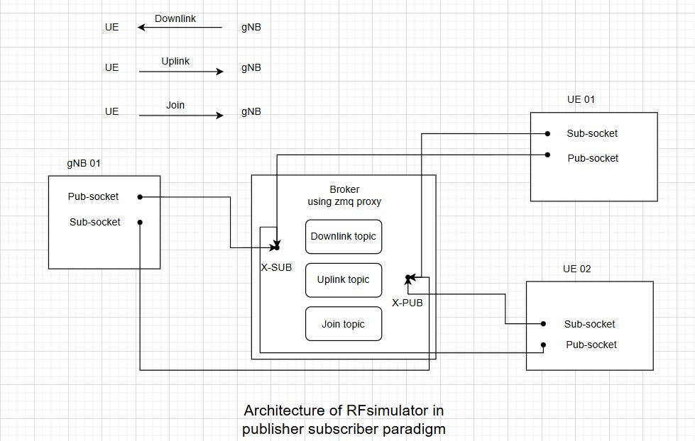

# Overview

The original implementation of the RF simulator has certain limitations, particularly with regard to sidelink and mobility features. This is due to its client-server architecture, which was implemented using BSD sockets. To overcome these constraints, we transitioned to a publisher-subscriber paradigm using the ZMQ library. This new approach enhances scalability, enabling support for a larger number of devices.  
# Architecture

The main components in the new architecture are:  
**Broker**: The broker is built using XSUB and XPUB sockets, and the [zmq proxy](http://api.zeromq.org/4-2:zmq-proxy) function to route traffic between the two sockets.

The gNB and the UE both have 2 sockets, a subscriber socket that connects to XPUB socket of the broker and a publisher socket that connects to XSUB socket of the broker.

**UE**: Subscribes to **downlink** topic.  
**gNB**: Subscribes to **uplink** topic, and **join** topic to detect connections from UEs.
## Topics
**Downlink**: a topic used to publish data from gNB to UE.  
**Uplink**: a topic used to publish data from UE to gNB.  
**First**: a topic used to publish the first message from gNB to UE.  
**Join**: a topic used to publish a join message from UE to gNB, when the UE is first connected to the broker.  


See the following diagram:


This setup has been tested with up to 35 UEs running on a machine featuring an Intel(R) Xeon(R) Silver 4216 CPU @ 2.10GHz, comprising 64 CPUs (2 NUMA nodes, each with 16 physical cores and 2 threads per core) and 128 GB of RAM.

# Build

NB : If you want to test with higher number of UEs than 16 UEs,  In `<path to oai sources>/openairinterface5g/common/openairinterface5g_limits.h`
Set MAX_MOBILES_PER_GNB to 64 

```
# define MAX_MOBILES_PER_GNB 64
```

## Using build_oai 

It's possible to build the rfsimulator device in its traditional implementation, whether by itself or with the OAI gNb or OAI UE

```
cd <path to oai sources>/openairinterface5g/cmake_targets

./build_oai -c -C --gNB --nrUE -w SIMU --ninja -I 
```

to build the publisher-subscriber version you need to add "--zmq" option, 
```
./build_oai --gNB --nrUE --zmq
```
to rebuild the rfsimulator only:
```
./build_oai -w SIMU --zmq
```
# Usage

## 1. Setup and Start OAI CN5G
for more details, refer to [CN5G setup](../NR_SA_Tutorial_OAI_CN5G.md).

To test with multiple UEs, add more records to the `AuthenticationSubscription` table of the core network database. 
You can replace your current file with [this one](../../tools/oai_db.sql) containing 64 records.


## 2. Launch the broker
Similar to the client-server rfsimulator, you can run the UEs and gNB. However, in the publisher-subscriber version, you must launch the broker first, then the gNB.

```
cd <path to oai sources>/openairinterface5g/cmake_targets/ran_build/build
./broker
```
## 3. Launch the gNB

```
sudo ./nr-softmodem -O ../../../targets/PROJECTS/GENERIC-NR-5GC/CONF/gnb.sa.band77.fr1.273PRB.usrpx300.conf --gNBs.[0].min_rxtxtime 6 --rfsim
``` 
## 4. Launch the UE

```bash
sudo ./nr-uesoftmodem -r 273 --numerology 1 --band 77 -C 3949740000  --ssb 1492 --uicc0.imsi 001010000000001 --rfsim --device_id 1
```
   
## 5. Launch multiple UEs
### Scenario
This section is about how to configure and run multiple OAI nrUE in the same end-to-end OAI 5G setup with RFsimulator.

### Pre-requisites

This section is assuming that OAI CN5G and OAI RAN are already deployed. To learn how to deploy and run a basic setup with OAI nrUE, please refer to [NR_SA_Tutorial_OAI_nrUE.md](NR_SA_Tutorial_OAI_nrUE.md).

RFsimulator:
- RFsimulator tutorial [rfsimulator/README.md](../radio/rfsimulator/README.md)

### Multiple nrUEs with namespaces

Important notes:

* This should be run on the same host as the OAI gNB
* Use the script [multi_ue.sh](../tools/scripts/multi-ue.sh) to make namespaces for multiple UEs.
* For each UE, a namespace shall be created, each one has a different address that will be used as the broker address
* Each UE shall have a different IMSI, which shall be present in the relevant tables of the MySQL database
* Each UE shall have a different device id (from 0 to 249)
1. For the first UE, create the namespace ue1 (`-c 1`), then execute shell inside (`-o 1`, "open"):

   ```bash
   sudo ./multi-ue.sh -c 1
   sudo ./multi-ue.sh -o 1
   ```

2. After entering the bash environment, run the following command to deploy your first UE

   ```bash
   sudo ./nr-uesoftmodem -r 273 --numerology 1 --band 77 -C 3949740000  --ssb 1492 --uicc0.imsi 001010000000001 --rfsim --device_id 1 --brokerip 10.201.1.10
   ```

3. For the second UE, create the namespace ue2 (`-c 2`), then execute shell inside (`-o 2`, "open"):

   ```bash
   sudo ./multi-ue.sh -c 2
   sudo ./multi-ue.sh -o 2
   ```

4. After entering the bash environment, run the following command to deploy your second UE:

   ```bash
   sudo ./nr-uesoftmodem -r 273 --numerology 1 --band 77 -C 3949740000  --ssb 1492 --uicc0.imsi 001010000000002 --rfsim --device_id 2 --brokerip 10.202.1.10
   ```

In the command above, please note that the IMSI and the device id changed.


For each UE specify its device id as well as the accessible broker IP from its namespace. 


Make sure that the device id for each UE running is different.

# Ping :

To test the ping from UE_x

```
<path to oai sources>/openairinterface5g/tools/scripts/multi-ue.sh -o x

ping 192.168.70.135 -I oaitun_ue1

```

# Test Automation : 
You can use the following script to automatically launch a large number of UEs and monitor the gNB logs as they attach.
Before running the script, make sure to start the core network and the broker. Then, execute the following command:
```
sudo <path to oai sources>/openairinterface5g/tools/scripts/test_automation.sh --nb-ue 35
```
You can find all the logs in `<path to oai sources>/openairinterface5g/logs`.

# TODO
- Handle connection teardown.
- Make memory management more efficient.
- Add more features to the broker.


