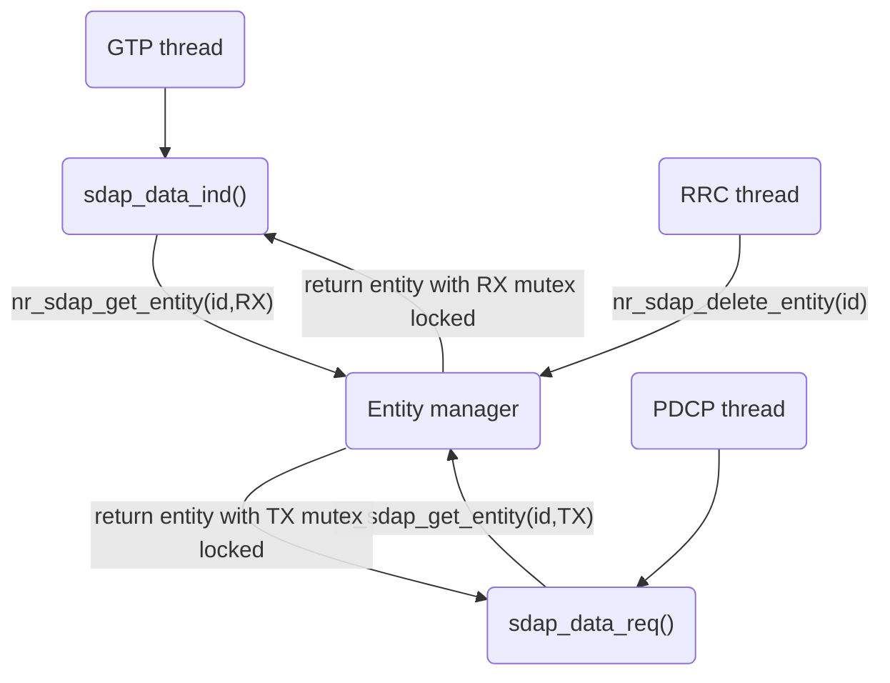

# SDAP Entity Manager

The SDAP entity manager in `nr_sdap_entity.c` is a linked list of entities and a set of functions. To prevent different threads from accessing the list at the same time, it is protected by a mutex `sdap_lock`. The following functions manage the list of entities and are proteced by `sdap_lock`.

1. `new_nr_sdap_entity()`: allocates memory for the new entity and add it to the list.
2. `nr_sdap_get_entity()`: finds and returns an entity.
3. `nr_sdap_delete_entity()`: finds and deletes an entity.
4. `nr_sdap_delete_ue_entity()`: finds and deletes all entities associated with a UE. This function is useful in gNB.

## SDAP Entity

Each entity is protected by two  mutexes each for TX and RX. Mutex for an entity is necessary becuase the RRC thread could delete an entity while it is being used by the GTP or PDCP thread. But having a single mutex affects performance when there is high amount of traffic in DL and UL simultaneously.

When the GTP thread wants to send data to SDAP, it calls `sdap_data_req()` that gets the entity through `nr_sdap_get_entity(id, TX)` that returns the entity with TX locked. `sdap_data_req()` does its job and unlocks the TX mutex before exiting.

Similarly, when the PDCP thread wants to send to SDAP, it calls `sdap_data_ind()` that calls `nr_sdap_get_entity(id, RX)`. After the job is done, it releases the mutex.

To ensure the entity is not deleted when being used, the two delete functions lock TX and RX entites before deleting the entity.